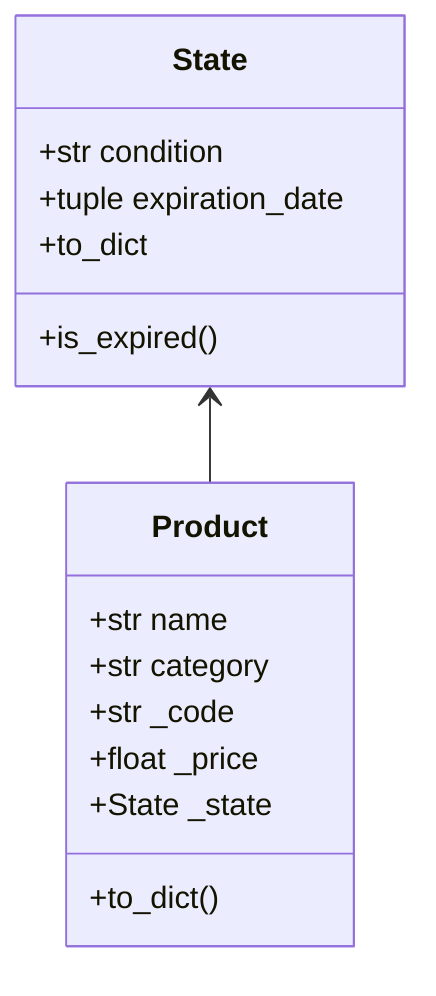

<h1 align="center"> Inventory Management - Stokapp </h1>

<h2 align="center"> Final OOP Project </h2>

The main goal of this project is build an application that simulates an inventory management system for a warehouse using a graphical user interface (GUI). 
The program includes operations such as:
  - Creating objects to be stored  
  - Registering incoming and outgoing inventory
  - Retrieving a list of current inventory
  - Handling dates in inventory records

In addition, it offers extra features like:
  + Bulk record upload
  + File handling for data persistence
  + Report generation in document format

<h2 align="center"> Index </h2>

- [Products]()
  - [Product]()
  - [State]()
- [Inventory_Management]()
  - [Inventory_Record]()
  - [Location]()
  - [Stock]()
  - [Inventory]()
- [People]()
  - [Customer]()
  - [Supplier]()
- [Transactions]()
  - [Movements]()
  - [Payment]()
  - [Bills]()
- [Operations_Center]()
  - [System]()
  - [Extracts]()
  - [Generatepdf]()
  - [App]()

-----------

<h3 align="center"> Products </h3>



#### Product


In the `Product` class, through the `__init__` method, we define the products that will be part of our inventory system. Each product has five main attributes: `name`, `category`, `code`, `price`, and `state`. The `name` attribute represents the product’s commercial name, while `category` allows us to classify it within a general category (such as "Vegetables" or "Grains"). The `code` field, which is protected using an underscore (`_code`), corresponds to the internal identifier of the product, allowing it to be distinguished from others in the system. Similarly, `price` (also protected as `_price`) indicates the monetary value of the product, and `state` is an object that describes its current status. The latter can be `None` if no state is defined at the time the product is created.


```python
class Product:
    def __init__(self, name, category, code, price, state):
        self.name = name
        self.category = category
        self._code = code
        self._price = price
        self._state = state
```

With the `to_dict` method, we convert each instance of `Product` into a Python dictionary, which is useful for tasks like storing data in databases using JSON. The dictionary includes keys such as `"name"`, `"category"`, `"code"`, `"price"`, and `"state"`, and their respective values correspond to the object's attributes. In particular, if the `_state` attribute exists, it will also be converted into a dictionary using its own `to_dict` method; otherwise, it will be recorded as `None`.

```python
    def to_dict(self):
        return {
            "name": self.name,
            "category": self.category,
            "code": self._code,
            "price": self._price,
            "state": self._state.to_dict() if self._state else None
        }
```
This structure allows us to keep all the product information organized and easily accessible for processing within the inventory system.


#### State

The `State` class represents the condition in which a product in the inventory is found. Each instance must contain at least one of the two attributes: a `condition` or an `expiration_date`. Although both parameters are optional in the constructor’s signature, the system’s logic assumes that at least one of them must be present for the state to be meaningful.


```python
class State:
    def __init__(self, condition = None, expiration_date = None):
        self._condition = condition
        self._expiration_date = expiration_date
```

The `_condition` attribute is a string that can represent, for example, that the product is "Fresh" (this is used for products like `Fruits` or `Vegetables`). On the other hand, `_expiration_date` must be provided as a tuple of three values (`YYYY`, `MM`, `DD`), and it represents the date on which the product is no longer valid or useful (this is used for packaged products with a specific expiration date). Although neither field is required individually, the system expects at least one of them to be defined.

One of the core methods is `is_expired`, which allows checking whether the product’s expiration date has already passed. If `_expiration_date` is defined, it is converted into a `datetime.date` object and compared with the current date. If the product has no expiration date, the method simply returns `False`.


```python
    def is_expired(self):
        if self._expiration_date:
            today = datetime.date.today()
            expiration = datetime.date(*self._expiration_date)
            return today > expiration
        return False
```
The `to_dict` method converts the product's state into a dictionary. If the state has a condition, it will be included under the `"condition"` key; if it has an expiration date, it will be included as `"expiration_date"`. If both are present, both will be reflected in the dictionary.

```python
    def to_dict(self):
        state_dict = {}
        if self._condition is not None:
            state_dict["condition"] = self._condition
        if self._expiration_date is not None:
            state_dict["expiration_date"] = self._expiration_date
        return state_dict
```
Additionally, the class implements the special method `__str__`, which generates a readable representation of the product's state. If a valid condition exists, it will be shown as `"Condition: <condition>"`. If there is an expiration date, it will be displayed in the format `"Expires: YYYY-MM-DD"`. When both attributes exist, they are concatenated separated by a comma; if neither is present (although this should not happen according to the system logic), the string `"Unknown"` is returned.

```python
    def __str__(self):
        state_parts = []
        if isinstance(self._condition, str):
            state_parts.append(f"Condition: {self._condition}")
        if self._expiration_date:
            date = datetime.date(*self._expiration_date)
            date_str = date.strftime("%Y-%m-%d")
            state_parts.append(f"Expires: {date_str}")
        return ", ".join(state_parts) if state_parts else "Unknown"
```
In summary, the `State` class allows describing the physical or temporal condition of a product, ensuring that there is at least one criterion to determine whether the product is usable, expired, or needs inspection. This class can be easily integrated with other parts of the system through its `to_dict` and `__str__` methods.

-----------

<h3 align="center"> Inventory_Management </h3>

#### Inventory Record:

In the `InventoryRecord` class, the `__init__` method defines the attributes that the inventory record will have, such as `product`, `stock`, and `location`. These will act as objects.

```python
class InventoryRecord:
    def __init__(self, product, stock, location):
        self.product = product
        self.stock = stock
        self.location = location
```

We reference the attributes of our `InventoryRecord` class through our constructor `self` using the names `product`, `stock`, and `location`.

```python
    def to_dict(self):
        return {
            "product": self.product.to_dict(),
            "stock": self.stock.to_dict(),
            "location": self.location.to_dict()
        }
```

We convert the attributes of our `InventoryRecord` class into a dictionary with the keys: `product`, `stock`, and `location`.

#### Location:

We create the `Location` class to which we assign some protected attributes outside the constructor that are shared among all instances of the class. These are `_category_aisles`, which is the category of each aisle and is an empty dictionary; `_next_aisle_number`, which dictates the next aisle number, incrementing one by one; `_shelf_counter_by_category`, which counts how many shelves have been assigned per category (also an empty dictionary); and `_product_shelving = {}`, which is a dictionary of each product’s shelving.

```python
class Location:
    _category_aisles = {}
    _next_aisle_number = 1
    _shelf_counter_by_category = {}
    _product_shelving = {}
```

We define the attributes of our `Location` class, which are `aisle` (aisles) and `shelf` (shelves).


```python
    def __init__(self, aisle, shelf):
        self.aisle = aisle
        self.shelf = shelf
```

With the `@classmethod` decorator, we indicate that the method works with the entire class. We define the `sync_from_inventory` method so that, for each record in the records dictionary, an aisle and shelf are assigned, and the variables `category`, `code`, `aisle`, and `shelf` are taken.

```python
    @classmethod
    def sync_from_inventory(cls, records):
        for record in records:
            category = record.product.category
            code = record.product._code
            aisle = int(record.location.aisle)
            shelf = int(record.location.shelf)
```

If the category is not assigned to a specific aisle, this method will assign it an available one.

```python
    @classmethod
    def sync_from_inventory(cls, records):
        for record in records:
            category = record.product.category
            code = record.product._code
            aisle = int(record.location.aisle)
            shelf = int(record.location.shelf)

            if category not in cls._category_aisles:
                cls._category_aisles[category] = aisle
                cls._next_aisle_number = max(cls._next_aisle_number, aisle+1)
            cls._product_shelving[(category, code)] = shelf
            cls._shelf_counter_by_category[category] = max(
                cls._shelf_counter_by_category.get(category, 0),
                shelf
            )
```

With the `@classmethod` decorator, we indicate that the method works with the entire class and not just individual objects. We define the `assign_location` method. If the `category` instance does not have an assigned aisle, it will be assigned an available one, so that if one aisle is occupied, the next one will be checked until an available one is found. The variables `aisle` and `key` will be used.

```python
    @classmethod
    def assign_location(cls, category, code):
        if category not in cls._category_aisles:
            cls._category_aisles[category] = cls._next_aisle_number
            cls._next_aisle_number += 1
        aisle = cls._category_aisles[category]
        key = (category, code)
```

If the `key` is in an aisle, the variable `shelf` will be assigned to it. If not, an available aisle will be assigned, starting from 0 and checking one by one to see which is available.

```python
        if key in cls._product_shelving:
            shelf = cls._product_shelving[key]
        else:
            cls._shelf_counter_by_category.setdefault(category, 0)
            cls._shelf_counter_by_category[category] += 1
            shelf = cls._shelf_counter_by_category[category]
            cls._product_shelving[key] = shelf
        return cls(aisle, shelf)
```

Through the `to_dict` method, we convert the product location information into a dictionary with the keys `aisle` and `shelf`.


```python
    def to_dict(self):
        return {
            "aisle": self.aisle,
            "shelf": self.shelf
        }
```

#### Stock:

From the `Inventory_System.Transactions.movements` module, we import the `Movement` class.

```python
from Inventory_System.Transactions.movements import Movement
```

We create the `Stock` class with attributes such as `actual_stock`, `minimum_stock`, `maximum_stock`, and `_record`, which is an empty list.

```python
    def __init__(self, actual_stock, minimum_stock, maximum_stock):
        self._actual_stock = actual_stock
        self.minimum_stock = minimum_stock
        self.maximum_stock = maximum_stock
        self._record = []
```

The `get_actual_stock` method is defined, which, when called to check the current stock, will return it to us.

```python
    def get_actual_stock(self):
        return self._actual_stock
```

The `is_valid_update` method is defined with an attribute `delta` that represents the stock change. The method checks that before modifying the stock, the change does not leave the stock below the minimum or above the maximum allowed.

```python
    def is_valid_update(self, delta):
        new_stock = self._actual_stock + delta
        return 0 <= new_stock <= self.maximum_stock
```

The `update_stock` method is defined to update the stock of a product. Through this method, if the stock update is not valid, it will return the message `"Cannot update stock"`. If it is valid, the `delta` movement will be added to the current stock, whether it is incoming or outgoing. If a movement is passed, it is saved in the records dictionary; otherwise, it returns the message `"Only Movement instances are allowed to update stock"`.

```python
    def update_stock(self, delta, movement):
        if not self.is_valid_update(delta):
            print("Cannot update stock.")
            return False
        if not isinstance(movement, Movement):
            raise TypeError(
                "Only Movement instances are allowed to update stock."
                )
        self._actual_stock += delta
        self._record.append(movement)
        return True
```

We define the `update_stock_limits` method with the instances `new_min` and `new_max` to update the minimum and maximum stock of a product. If there is an attempt to update the minimum or maximum stock to a value less than 0, it will return the error message `"Stock limits cannot be negative"`. If the minimum stock is updated to be higher than the maximum stock, it will return the error message `"Minimum stock cannot exceed maximum stock"`. If the change is valid, it will be updated.

```python
    def update_stock_limits(self, new_min, new_max):
        if new_min < 0 or new_max < 0:
            raise ValueError("Stock limits cannot be negative.")
        if new_min > new_max:
            raise ValueError("Minimum stock cannot exceed maximum stock.")
        self.minimum_stock = new_min
        self.maximum_stock = new_max
```

The `to_dict` method returns the current stock, minimum stock, and maximum stock in a dictionary with the keys `actual_stock`, `minimum_stock`, and `maximum_stock`.

```python
    def to_dict(self):
        return {
            "actual_stock": self._actual_stock,
            "minimum_stock": self.minimum_stock,
            "maximum_stock": self.maximum_stock,
            "record": [mov.to_dict() for mov in self._record]
        }    
```

#### Inventory:

In the `Inventory` class, we define two attributes where we will store data, which are created directly from the object without needing to receive them as parameters. These are: `self.records`, which is an empty dictionary, and `self.movements`, which is an empty list.

```python
class Inventory:
    def __init__(self):
        self.records = {}
        self.movements = []
```

We define the function `add_record`, which will help us add a record to the records dictionary using the product code, in case it is not already in the dictionary. If the product is already in the dictionary, it returns an error message: `"This product already exists in the inventory"`.

```python
    def add_record(self, record):
        code = record.product._code
        if code not in self.records:
            self.records[code] = record
        else:
            print("This product already exists in the inventory.")
```

The function `remove_record` was defined to, as its name suggests, remove a product’s record by code using the `del` statement. The function will look for the code in the records library. If the code is found, the function proceeds correctly and deletes the record from the library. If the code is not found, the system throws the message "*No record found with this code*".

```python
    def remove_record(self, code):
        if code in self.records:
            del self.records[code]
        else:
            print("No record found with this code.")
```

The `update_stock_limits` method is defined, which will update the allowed minimum and maximum stock limits for a product. If the product code is not found in the records dictionary, it will return the error message `"Product not found in inventory records"`.

```python
    def update_stock_limits(self, product_code:str, new_min:int, new_max:int):
        if product_code not in self.records:
            raise ValueError("Product not found in inventory records.") 
        self.records[product_code].stock.update_stock_limits(new_min, new_max)
```

Each quantity change (defined as `movement`), whether incoming or outgoing, will be stored in the movements list with the command `self.movements.append(movement)`. If the stock update applies, it will then be saved in the records dictionary by product code (`product_code`). `delta` is defined as the inventory quantity change, either positive or negative. Afterwards, the stock is updated with the command `self.records[product_code].stock.update_stock(delta, movement)`, which takes the product code, and the `update_stock()` method of `stock` is responsible for updating the product’s inventory.

```python
    def add_movement(self, movement, apply_stock: bool = True):
        self.movements.append(movement)
        if apply_stock:
            product_code = movement.product._code
            delta = movement.get_delta()
            self.records[product_code].stock.update_stock(delta, movement)
```

In case you want to check each movement, the function `get_movements_by_code` was defined, which allows querying all movements in the form of a list for a specific product by its code.

```python
    def get_movements_by_code(self, code):
        return [
            movement for movement in self.movements if 
                movement.product.code == code
        ]
```

The `get_critical_records` method is used to return all product records whose current stock is below the minimum allowed, for each record in the records dictionary.

```python
    def get_critical_records(self):
        return [
            r for r in self.records.values()
            if r.stock.get_actual_stock() < r.stock.minimum_stock
        ]
```

The `restock_suggestions` method suggests which products need to be restocked according to the established minimum, meaning those with stock below it. It takes the products from the list returned by the `get_critical_records` method and returns their values with the keys `Name`, `Code`, `Current Stock`, and `Minimum Required`.

```python
    def restock_suggestions(self):
        return [
            {
            "Name": r.product.name,
            "Code": r.product._code,
            "Current Stock": r.stock.get_actual_stock(),
            "Minimum Required": r.stock.minimum_stock
            }
            for r in self.get_critical_records()
        ]
```
-----------

<h3 align="center"> People </h3>

#### Customer:

In the `Customer` class, through the `__init__` method, we define our customer with main attributes such as `name`, `number_id`, and `customer_id`.

```python
import uuid

class Customer:
    def __init__(self, name, number_id, customer_id=None):
        self.name = name
        self.number_id = number_id
        self._id = customer_id if customer_id else str(uuid.uuid4())
```

Using the constructor `self`, we reference the attributes that our `Customer` class will have: `name`, `number_id`, and a `customer_id` for which we use the `uuid` library to generate a universally unique identifier (UUID) for each customer, ensuring these identifiers do not repeat for security reasons, as it is extremely unlikely. With UUID version `uuid4`, we obtain a completely random identifier, which exponentially increases security; however, if needed, the customer's identifier can also be manually assigned.

```python
    def to_dict(self):
        return {
            "name": self.name,
            "number_id": self.number_id,
            "_id": self._id
        }
```
 
With the `to_dict` method, we convert the objects of the `Customer` class into a Python dictionary with the keys: `name`, `number_id`, and `_id`.

#### Supplier:

In the `Supplier` class, through the `__init__` method, we also define our supplier with main attributes such as `name`, `contact_number`, and `supplier_id`.

```python
import uuid

class Supplier:
    def __init__(self, name, contact_number, supplier_id=None):
        self.name = name
        self.contact_number = contact_number
        self._id = supplier_id if supplier_id else str(uuid.uuid4())
```

Using the constructor `self`, we also reference the attributes of our `Supplier` class, which are similar but not the same as those of the previous class. In this case, the attributes are `name`, `contact_number` (which differs from the `Customer` class), and `supplier_id`, which, like in the previous class, we randomize using UUID version `uuid4`.

```python
    def to_dict(self):
        return {
            "name": self.name,
            "contact_number": self.contact_number,
            "_id": self._id
        }
```

As with the previous class, we convert the objects of our `Supplier` class into a dictionary with the keys: `name`, `contact_number`, and `_id`.

-----------

<h3 align="center"> Transactions </h3>

#### Movements:

We import the `datetime` library, and from the `Inventory_System.People` module, we import `Customer` and `Supplier`.

```python
from datetime import datetime
from Inventory_System.People.customer import Customer
from Inventory_System.People.supplier import Supplier
```

The `Movement` class represents an individual inventory movement record. Each movement is related to a product, an amount (`amount`), a reason or motive for the movement, and an actor (customer or supplier) that generates it. The date is also recorded, and it is determined whether the movement is incoming or outgoing.

The `__init__` constructor is a method that initializes a new movement with the provided information: the involved product, the quantity of units, the actor (customer or supplier) performing it, and the reason for the movement.

```python
class Movement:
    def __init__(self, product, amount, actor, reason):
        self.product = product
        self.amount = amount
        self.date = datetime.now()
        if not isinstance(actor, (Customer, Supplier)):
            raise TypeError("actor must be a Customer or Supplier")
        self.actor = actor
        self._actor_id = actor._id
        self.actor_type = "customer" if isinstance(actor, Customer) else "supplier"
        self.type = "out" if isinstance(actor, Customer) else "in"
        self.reason = reason
```
- The reference to the product and the quantity (`amount`) are stored directly.

- `datetime.now()` is used to capture the date of the movement at the moment of its creation.

- It validates that the actor is an instance of either `Customer` or `Supplier`; otherwise, it raises a `TypeError`.

- The actor's identifier (`_actor_id`) is stored, and the actor is classified as either a customer or a supplier using `actor_type`.

- Automatically, the type of movement is set to `"out"` if performed by a customer (inventory outgoing), or `"in"` if performed by a supplier (inventory incoming).

- Finally, the reason for the movement is saved.

The `get_delta` method calculates the change this movement represents on the product's inventory.

```python
    def get_delta(self):
        return self.amount if self.type == "in" else -self.amount
```
- If the movement is incoming (`"in"`), it returns the quantity as a positive value.

- If the movement is outgoing (`"out"`), it returns the quantity as a negative value.

- This result can be used directly to update the product's inventory.

The `to_dict` method converts the movement into a Python dictionary, ideal for serialization, storage, or structured printing.

```python
    def to_dict(self):
        return {
            "Product": self.product.name,
            "Code": self.product._code,
            "Quantity": self.amount,
            "Type": self.type,
            "Date": self.date.strftime("%Y-%m-%d"),
            "Actor": self.actor.name if self.actor else "N/A",
            "Actor_ID": self._actor_id,
            "Reason": self.reason
        }
```
It returns key information about the movement, such as the product’s name and code, the quantity, the movement type (`in` or `out`), the formatted date, the actor’s name and ID, and the recorded reason.

#### Payment:
In the `Payment` class, we define an abstract base class for all payment methods. That is, this class will not be used directly to make payments, but serves as a template for child classes like `Card` and `Cash`. In it, we define two methods (`pay` and `to_dict`) that must be implemented by the subclasses.

```python
class Payment:
    def __init__(self):
        pass

    def pay(self, amount):
        raise NotImplementedError("Subclasses must implement the pay() method.")

    def to_dict(self):
        raise NotImplementedError("Subclasses must implement the to_dict() method.")
```

The `Card` class inherits from `Payment` and represents a card payment method. In its constructor (`__init__`), we receive the card number and the CVV code. We use `super()` to call the base class constructor.

```python
class Card(Payment):
    def __init__(self, number, cvv):
        super().__init__()
        self._number = number
        self._cvv = cvv
```
The `pay` method in this class simulates the action of paying by card. It prints a console message indicating how much will be paid and shows the last 4 digits of the card number.

```python
    def pay(self, amount):
        print(f"Paying {amount} with card ending in {self._number[-4:]}")
        return True
```

The `to_dict` method converts the card data into a dictionary, hiding the full number for security reasons. It only shows the last 4 digits.

```python
    def to_dict(self):
        return {
            "method": "Card",
            "card_number": f"**** **** **** {self._number[-4:]}"
        }
```

Finally, with the `__str__` method, we return a readable text representation of the `Card` object, also showing only the last digits of the number.

```python
    def __str__(self):
        return f"Card - **** **** **** {self._number[-4:]}"
```

The `Cash` class also inherits from `Payment`, but represents cash payments. In its constructor, it stores the amount given by the customer.

```python
class Cash(Payment):
    def __init__(self, cash_given):
        super().__init__()
        self.cash_given = cash_given
```

The `pay` method checks if the cash provided is enough to cover the payment amount. If sufficient, it calculates the change and prints it; if not, it informs how much is missing.

```python
    def pay(self, amount):
        if self.cash_given >= amount:
            change = self.cash_given - amount
            print(f"Cash payment accepted. Change returned: {change}")
            return True
        else:
            print(f"Insufficient cash. Missing: {amount - self.cash_given}")
            return False
```

The `to_dict` method converts the cash payment data into a dictionary that stores the method and the amount given.

```python
    def to_dict(self):
        return {
            "method": "Cash",
            "cash_given": self.cash_given
        }
```

Finally, `__str__` returns a readable representation of the `Cash` object, indicating how much money the customer provided.

```python
    def __str__(self):
        return f"Cash - Given: ${self.cash_given:.2f}"
```

#### Bills:
This module allows managing purchase or sales invoices associated with an entity (either a customer or a supplier), including a list of products, their quantities, prices, and the corresponding payment method.

The `BillItem` class represents a single item within an invoice. It contains three essential attributes: the `product`, the `quantity` purchased, and the unit `price` of that product.

```python
class BillItem:
    def __init__(self, product, quantity, price):
        self.product = product
        self.quantity = quantity
        self.price = price
```

With the `get_total_price` method, we calculate the total price of the item by multiplying the quantity by the unit price.

```python
    def get_total_price(self):
        return self.quantity * self.price
```

The `to_dict` method allows converting the item into a Python dictionary, useful for serialization or storage. It includes the product’s name and code, the quantity, unit price, and total.

```python
    def to_dict(self):
        return {
            "Product": self.product.name,
            "Code": self.product._code,
            "Quantity": self.quantity,
            "Price": self.price,
            "Total": self.get_total_price()
        }
```

The `Bill` class represents a complete invoice. It includes an entity (which can be a customer or a supplier), the issue date, a unique identifier, the payment method, and a list of items (`BillItem`) that compose the invoice.

```python
class Bill:
    def __init__(self, entity, payment_method):
        self._bill_id = str(uuid.uuid4())
        self.date = datetime.now()
        self.entity = entity
        self.entity_type = "Customer" if isinstance(entity, Customer) else "Supplier"
        self.payment_method = payment_method
        self.items = []
```
In this constructor, a unique ID for the invoice is automatically generated using `uuid4`, and the current date is recorded using `datetime.now()`. The entity type (`Customer` or `Supplier`) is identified by checking the class of the received object. The empty list of items that will later be added to the invoice is also initialized.

With the `add_item` method, products are added to the invoice. A new `BillItem` object is created with the product, quantity, and price, and then added to the list of items.

```python
    def add_item(self, product, quantity, price):
        item = BillItem(product, quantity, price)
        self.items.append(item)
```

The `calculate_total` method sums the total of all items that have been added to the invoice, using the `get_total_price` function defined in each `BillItem`.

```python
    def calculate_total(self):
        return sum(item.get_total_price() for item in self.items)
```

Finally, `to_dict` converts all the invoice information into a structured dictionary. This includes the ID, the date in year-month-day format, the entity’s name, its type, the payment method (converted to a dictionary if present), the list of items (also as dictionaries), and the grand total.

```python
    def to_dict(self):
        return {
            "bill_id": self._bill_id,
            "date": self.date.strftime("%Y-%m-%d"),
            "entity": self.entity.name,
            "entity_type": self.entity_type,
            "payment_method": self.payment_method.to_dict() if self.payment_method else "N/A",
            "items": [item.to_dict() for item in self.items],
            "total": self.calculate_total()
        }
```

-----------

<h3 align="center"> Operations_Center </h3>

<h3 align="left"> Extracts </h3>

The `Extracts` class encapsulates all operations related to exporting, importing, and reconstructing data from the inventory system.


*It is important to clarify that, at the beginning of each method, the `@staticmethod` decorator is used in all methods of the `Extracts` class because these methods do not need to access or modify any attribute or internal state of a specific instance of the class. That is, their behavior depends exclusively on the data they receive as arguments, not on internal properties of `self`. Using `@staticmethod` in this context allows organizing export and import utilities functionally within the same class, without needing to create instances of it, which is more efficient and clearer from a software design point of view.*

<h4 align="left"> Queries: retrieving data from the system as lists of dictionaries: </h4>

```python
@staticmethod
def get_movements(system):
    return [movement.to_dict() for movement in system.movements]
```

This method iterates over all movements (`system.movements`) and calls `to_dict()` on each one, converting them into dictionaries to facilitate their export.

```python
@staticmethod
def get_bills(system):
    return [bill.to_dict() for bill in system.bills.values()]
```
This method extracts all invoices from the system (`system.bills` is a dictionary), converts them to dictionaries using `to_dict()`, and returns a list with all of them.

```python
@staticmethod
def get_records(system):
    return [record.to_dict() for record in system.records.values()]
```
This method converts all inventory records (which contain products and stock) into dictionary format.

```python
@staticmethod
def get_customers(system):
    return [customer.to_dict() for customer in system.customers.values()]
```
This method returns all customers in the system as a list of dictionaries, useful for saving or reconstructing them later.

```python
@staticmethod
def get_suppliers(system):
    return [supplier.to_dict() for supplier in system.suppliers.values()]
```
This method is similar to the previous one, but for suppliers.

#### Generic data export to `.json` files
```python
@staticmethod
def export_to_json(data, filename):
    try:
        with open(filename, "w", encoding="utf-8") as f:
            json.dump(data, f, indent=4, ensure_ascii=False)
        print(f"Exported successfully to {filename}")
    except Exception as e:
        raise ValueError(f"Error exporting to {filename}: {e}")
```
This method saves any `data` (a list of dictionaries) into a `.json` file.

- It uses indentation to make the file readable.

- `ensure_ascii=False` allows saving special characters (like accents).

- It catches write errors and raises an explanatory exception.

<h4 align="left"> Specific exports by object type </h4>

Each of these methods uses the previous (`get_...`) methods and the general exporter:

```python
@staticmethod
def export_movements(system, filename="movements.json"):
    Extracts.export_to_json(Extracts.get_movements(system), filename)
```
This method exports all system movements to `movements.json`.

```python
@staticmethod
def export_bills(system, filename="bills.json"):
    Extracts.export_to_json(Extracts.get_bills(system), filename)
```
This method exports all invoices to `bills.json`.

<h4 align="left"> Full system export </h4>

```python
@staticmethod
def export_full_system(system, filename="full_backup.json"):
    data = {
        "movements": Extracts.get_movements(system),
        "bills": Extracts.get_bills(system),
        "records": Extracts.get_records(system),
        "customers": Extracts.get_customers(system),
        "suppliers": Extracts.get_suppliers(system)
    }
    Extracts.export_to_json(data, filename)
```

This method creates a dictionary with all the system’s key data and exports it into a single file. This file can be used as a general backup or to load the entire system at another time.

<h4 align="left"> Importing products from a JSON file </h4>

```python
@staticmethod
def import_all_products(filename):
    with open(filename, 'r') as f:
        data = json.load(f)
    return [Extracts.dict_to_product(d) for d in data]
```
This method opens the `filename`, then loads the data as a list of dictionaries (`data`), and for each dictionary calls the `dict_to_product` method to convert it into a `Product` object.

<h4 align="left"> Product reconstruction </h4>

```python
@staticmethod
def dict_to_product(data):
    name = data["name"]
    category = data["category"]
    code = data["code"]
    price = data["price"]
    state_data = data["state"]
```

This block extracts the essential fields from the `data` dictionary to then determine the type of state:

```python
if isinstance(state_data, dict):
    if "expiration_date" in state_data:
        expiration = tuple(state_data["expiration_date"])
        state = State(expiration_date=expiration)
    elif "condition" in state_data:
        state = State(state_data["condition"])
    else:
        raise ValueError("Unknown format for product state")
elif isinstance(state_data, str):
    state = State(state_data)
else:
    raise ValueError("Unsupported type for product state")
```
What this method does is that if the state is a dictionary with `"expiration_date"`, it converts it into a tuple and creates a `State`. If it has `"condition"`, it creates a `State` with that condition, and if the data type is not compatible, it raises `ValueError` exceptions, to finally:

```python
return Product(name, category, code, price, state)
```
Return a complete `Product` object ready to be used.

<h4 align="left"> Converting entities from dictionaries </h4>

```python
@staticmethod
def dict_to_customer(data):
    return Customer(data["name"], data["number_id"], data["_id"])
```
This method reconstructs the `Customer` object from a dictionary to be used when loading backups.
```python
@staticmethod
def dict_to_supplier(data):
    return Supplier(data["name"], data["contact_number"], data["_id"])
```
This method does the same, but this time with the `Supplier` object.

<h4 align="left"> Stock reconstruction (quantity, minimums, history) </h4>

```python
@staticmethod
def dict_to_stock(data, system):
    actual = data["actual_stock"]
    min_stock = data["minimum_stock"]
    max_stock = data["maximum_stock"]
    stock = Stock(actual, min_stock, max_stock)
```
This method creates the `Stock` object with its minimum and maximum parameters, then reconstructs the history.

```python
if system and "record" in data:
    seen = set()
    for movement_data in data["record"]:
        code = movement_data["Code"]
        if code in system.records:
            movement = Extracts.dict_to_movement(movement_data, system)
            key = (movement.product._code, movement.amount, movement.actor._id, movement.date.isoformat())
            if key not in seen:
                stock._record.append(movement)
                seen.add(key)
```
What this method does is, if there is a movement history (`record`), it reconstructs it, avoiding duplicate movements by using a set (`seen`) of unique keys.

<h4 align="left"> Movement conversion </h4>

```python
@staticmethod
def dict_to_movement(data, system):
    product_code = data["Code"]
    product = system.records[product_code].product
    amount = data["Quantity"]
    actor_id = data["Actor_ID"]
    reason = data["Reason"]
```

This method retrieves the fields in the movement. Then:

```python
if data["Type"] == "in":
    actor = system.suppliers.get(actor_id)
else:
    actor = system.customers.get(actor_id)

if actor is None:
    raise ValueError(f"Actor with ID {actor_id} not found in system")

return Movement(product, amount, actor, reason)
```
This method determines if the actor is a supplier or customer based on the movement type. It creates a `Movement` with the corresponding data.

<h4 align="left"> Invoice reconstruction </h4>

```python
@staticmethod
def dict_to_bill(data, system):
    bill_id = data["bill_id"]
    date = data["date"]
    entity_type = data["entity_type"]
    entity_id = data.get("entity_id")
    payment_data = data["payment_method"]
```
This method extracts the basic invoice data. Then:

```python
if entity_type == "Customer":
    entity = system.customers.get(entity_id)
else:
    entity = system.suppliers.get(entity_id)

# reconstruir método de pago
if payment_data["method"] == "Cash":
    payment = Cash(payment_data["cash_given"])
elif payment_data["method"] == "Card":
    card_number = str(payment_data["card_number"])[-4:]
    payment = Card("**** **** **** " + card_number, "***")
else:
    raise ValueError("Unknown payment method.")
```
This method creates the entity object and the appropriate payment method. Then the invoice is created and its ID and date are set:

```python
bill = Bill(entity, payment)
bill._bill_id = bill_id
bill.date = datetime.strptime(date, "%Y-%m-%d")
```
Finally, the invoiced products are added:

```python
for item_data in data["items"]:
    product_code = item_data["product"]["_code"]
    product = system.records[product_code].product
    quantity = item_data["quantity"]
    price = item_data["price"]
    bill.add_item(product, quantity, price)
```

#### Total system load from a `.json` file

```python
@staticmethod
def load_full_backup(path, system):
    with open(path, "r", encoding="utf-8") as f:
        data = json.load(f)
```
Here the JSON file containing the full system backup is opened. Now we continue with the methods after loading the JSON file.

<h4 align="left"> Opening the file and loading data </h4>

```python
with open(path, "r", encoding="utf-8") as f:
    data = json.load(f)
```
This first block opens the JSON file containing the complete system backup, using the path provided in the `path` argument. The file content is loaded into memory via `json.load(f)` and stored in the variable `data` as a Python dictionary. This dictionary will contain keys such as `"customers"`, `"suppliers"`, `"records"`, `"movements"`, and `"bills"` which will be used to reconstruct the system components.

<h4 align="left"> Customer load </h4>

```python
for customer in data["customers"]:
    system.add_customer(Extracts.dict_to_customer(customer))
```
Then, the customers are reconstructed. To do this, each element in the `data["customers"]` list, representing serialized customer data, is iterated over. Each entry is transformed into a `Customer` object using the helper method `dict_to_customer`, and then added to the system via `system.add_customer()`. This recovers all customers registered before export.

<h4 align="left"> Supplier load </h4>

```python
for supplier in data["suppliers"]:
    existing = next(
        (
            x for x in system.suppliers.values() 
            if x.name == supplier["name"] 
            and x.contact_number == supplier["contact_number"]
        ), None
    )
    if not existing:
        system.add_supplier(Extracts.dict_to_supplier(supplier))
```
For suppliers, an additional step is performed: before adding a new supplier to the system, it checks if one already exists with the same name and contact number. If no duplicate supplier is found, the `Supplier` object is reconstructed from the dictionary using `dict_to_supplier` and added to the system. This prevents creating multiple entries for the same supplier during restoration.

<h4 align="left"> Inventory records upload </h4>

```python
for record in data["records"]:
    product_code = record["product"]["code"]
    if product_code in system.records:
        old_stock = system.records[product_code].stock
        new_stock = Extracts.dict_to_stock(record["stock"], system)
        existing_keys = {
            (
                m.product._code, m.amount, m.actor._id,
                m.date.isoformat()
            )
            for m in old_stock._record
        }
        for m in new_stock._record:
            key = (
                m.product._code, m.amount, m.actor._id, 
                m.date.isoformat()
            )
            if key not in existing_keys:
                old_stock._record.append(m)
    else:
        record = Extracts.dict_to_inventory_record(record, system)
        system.add_record(record)
```
This block restores all inventory records. If the product already exists in the system (verified by its code), its movement history is compared. The goal is to avoid duplicating already recorded movements, for which a unique key is generated for each movement (product, quantity, actor, and date). If any new movement is not in the existing ones, it is added to the history. If the product did not previously exist in the system, the complete record is reconstructed with `dict_to_inventory_record` and added as a new item.

<h4 align="left"> Location synchronization </h4>

```python
Location.sync_from_inventory(system.records.values())
```
Once all inventory records are loaded, the physical locations of the products are synchronized. The `sync_from_inventory` method ensures that each product is correctly assigned to its shelf and aisle within the system. This synchronization is important because the location may be necessary for physical inventory management in the real world.

<h4 align="left"> Movements load </h4>

```python
for movement_data in data["movements"]:
    movement = Extracts.dict_to_movement(movement_data, system)
    system.add_movement(movement, apply_stock=False)
    for movement1 in system.movements:
        code = movement1.product._code
        stock = system.records[code].stock
        key = (movement1.product._code, movement1.amount,
            movement1.actor._id, movement1.date.isoformat())
        seen = {
            (
                movement_stock.product._code, movement_stock.amount,
                movement_stock.actor._id, 
                movement_stock.date.isoformat()
            )
            for movement_stock in stock._record
        }
        if key not in seen:
            stock._record.append(movement1)
```
Here the movement history of products, both incoming and outgoing, is restored. First, each JSON entry is transformed into a `Movement` object and added to the system. Then, that movement is associated with the corresponding stock history, verifying that it is not already registered to avoid duplicates. This step ensures that the complete operation history is available for future queries or audits, without affecting the current stock (hence `apply_stock=False`).

<h4 align="left"> Invoice upload </h4>

```python
for bill_data in data.get("bills", []):
    bill = Extracts.dict_to_bill(bill_data, system)
    system.bills[bill._bill_id] = bill
```
This block is responsible for restoring all invoices in the system. Each invoice in JSON format is converted into a `Bill` object using `dict_to_bill`, which reconstructs both the entity (customer or supplier) and the payment method, the items purchased or sold, and the date. Then, the invoice is added to the system using its unique identifier `_bill_id`, ensuring that economic transactions are recorded accurately.

<h4 align="left"> Association between movements and invoices </h4>

```python
for m in system.movements:
    for item in bill.items:
        if (m.product._code == item.product._code
            and m.amount == item.quantity
            and m.actor._id == bill.entity._id):
            m._bill_id = bill._bill_id
            break

```
Finally, the relationship between inventory movements and the invoices they belong to is established. For each movement, its product, quantity, and actor are compared with the items within each invoice. If a match is found, the movement is assigned the corresponding invoice ID. This step allows, for example, an outgoing movement to be traced back to a specific sale, which is essential for traceability and administrative control.


<h3 align="left"> generatePDF </h3>

First, the classes and their methods are defined:

<h4 align="left"> Class PDF </h4>

```python
class PDF(FPDF):
    def __init__(self, title="Report"):
        super().__init__()
        self.title = title
```
The base class `PDF` is defined, inheriting from `FPDF`, which allows building PDF files in Python. In its constructor (`__init__`), the parent class is initialized with `super().__init__()` and the title to be displayed in the document header is stored, defaulting to `"Report"`.

```python
    def header(self):
        self.set_font("Helvetica", "B", 14)
        self.cell(0, 10, self.title, ln=True, align="C")
        self.set_font("Helvetica", "", 10)
        self.cell(
            0, 10, f"Date: {datetime.now().strftime('%Y-%m-%d')}",
            ln=True, align="C"
        )
        self.ln(5)
```
This method defines the PDF header. First, it sets a bold Helvetica font at size 14 and writes the centered title. Then, with a smaller font (Helvetica 10), it prints the current date centered. A small vertical space of 5 units is left after the header.

```python
    def footer(self):
        self.set_y(-15)
        self.set_font("Helvetica", "I", 8)
        self.cell(0, 10, f"Page {self.page_no()}", align="C")
```
Here the footer is defined. The cursor is positioned 15 units from the bottom edge, an italic small font is selected, and the current page number is printed centered.

```python
    def setup_page(self):
        self.set_auto_page_break(auto=True, margin=15)
        self.add_page()
```
This method helps configure the page by enabling automatic page breaks with a bottom margin of 15 units and adding a new page.

```python
    def _add_table_header(self, headers, col_widths):
        self.set_font("Helvetica", "B", 10)
        for i, header in enumerate(headers):
            self.cell(col_widths[i], 8, header, border=1, align="C")
        self.ln()
```
This internal method creates the header row of a table. It uses a bold font and writes each header cell with borders and centered alignment, according to the width specified by `col_widths`.

```python
    def _add_table_row(self, row_data, col_widths, line_height=8):
        self.set_font("Helvetica", "", 10)
        for i, cell in enumerate(row_data):
            self.cell(col_widths[i], line_height, str(cell), border=1)
        self.ln()
```
This method adds a data row to the table. It uses a normal font and iterates over each value in the row to write it in a cell with the corresponding width and border.

```python
    def generate_table(self, headers, rows, col_widths):
        self._add_table_header(headers, col_widths)
        for row in rows:
            self._add_table_row(row, col_widths)
```
This method allows building a complete table by receiving headers, rows, and widths. It first writes the header row and then each data row.

<h4 align="left"> Class InventoryReportPDF </h4>

```python
class InventoryReportPDF(PDF):
    def __init__(self):
        super().__init__(title="Inventory Report")
```
This class inherits from `PDF` and represents an inventory report. In its constructor, it calls the base class (`PDF`) constructor with a custom title: `"Inventory Report"`, which will be shown in the header of each page.

```python
    def generate(self, records, filename="inventory_report.pdf"):
        self.setup_page()
        headers = [
            "Code", "Name", "Category", "Stock",
            "Min", "Max", "Location", "State"
        ]
        col_widths = [15, 30, 25, 15, 15, 15, 35, 40]
        rows = []
```
The `generate` method is responsible for building the content of the PDF. It starts by setting up the page and then defines the column headers (`headers`) and their widths (`col_widths`). It also initializes an empty list `rows` to store each table row.

```python
        for record in records:
            product = record["product"]
            stock = record["stock"]
            location = record["location"]

            state_data = product["state"]
            if "expiration_date" in state_data:
                exp = state_data["expiration_date"]
                state_str = f"Expires: {exp[0]:04d}-{exp[1]:02d}-{exp[2]:02d}"
            elif "condition" in state_data:
                state_str = f"Condition: {state_data['condition']}"
            else:
                state_str = "Unknown"
```
It iterates over each record in `records`, extracting the product, its inventory information (`stock`), and its location. Then it checks if the product's state includes an expiration date or a specific condition, and builds the `state_str` string accordingly.

```python
            rows.append([
                product["code"],
                product["name"],
                product["category"],
                stock["actual_stock"],
                stock["minimum_stock"],
                stock["maximum_stock"],
                f"Aisle {location['aisle']} - Shelf {location['shelf']}",
                state_str
            ])
```
With all the processed information, it builds a list representing a row in the PDF table and adds it to `rows`.

```python
        self.generate_table(headers, rows, col_widths)
        self.output(filename)
```
Finally, it calls the inherited `generate_table` method to build the table and saves the PDF file with the provided name (default is `inventory_report.pdf`).

<h4 align="left"> Class MovementsReportPDF </h4>

```python
class MovementsReportPDF(PDF):
    def __init__(self):
        super().__init__(title="Inventory Movements Report")
```
This class generates an inventory movements report. In its constructor, a specific title `"Inventory Movements Report"` is passed to the base class.

```python
    def generate(self, movements, filename="movements_report.pdf"):
        self.setup_page()
        headers = [
            "Date", "Type", "Product Code", 
            "Quantity", "Actor", "Reason"
        ]
        col_widths = [25, 10, 25, 20, 60, 50]
        rows = []
```
The `generate` method prepares the page and defines the column headers and widths. The `rows` list is also initialized to store the movements.

```python
        for movement in movements:
            rows.append([
                movement["Date"],
                movement["Type"],
                movement["Code"],
                movement["Quantity"],
                movement["Actor"],
                movement["Reason"]
            ])
```
It iterates over each movement and extracts the relevant information to add it as a new row in the table.

```python
        self.generate_table(headers, rows, col_widths)
        self.output(filename)
```
The table is generated with the data and the PDF is saved under the specified name.


<h4 align="left"> Class BillPDF </h4>

```python
class BillPDF(PDF):
    def generate(self, bill, filename="bill_report.pdf"):
        self.add_page()
        self.set_font("Helvetica", "", 12)
```
This class also inherits from `PDF` and its purpose is to generate an invoice. Unlike others, it does not define its own constructor, so it uses the default title `"Report"`. In the `generate` method, it adds a new page and sets the base font for the document content.

```python
        self.cell(0, 10, f"Bill ID: {bill._bill_id}", ln=True)
        self.cell(0, 10, f"Date: {bill.date.strftime('%Y-%m-%d')}", ln=True)
        self.cell(0, 10, f"Entity: {bill.entity.name}", ln=True)
        self.cell(0, 10, f"Type: {bill.entity_type}", ln=True)
        self.cell(0, 10, f"Payment Method: {bill.payment_method}", ln=True)
```
Several basic invoice details are printed in the PDF: the ID, the date, the involved entity (customer or supplier), the entity type, and the payment method.

```python
        if isinstance(bill.payment_method, Cash):
            total = bill.calculate_total()
            given = bill.payment_method.cash_given
            if given >= total:
                change = given - total
                self.cell(
                    0, 10, f"Paid for: ${given:.2f} - Change: ${change:.2f}",
                    ln=True
                )
            else:
                lack = total - given
                self.cell(
                    0, 10, f"Cash Insuficient. Lack: ${lack:.2f}", ln=True
                )
```
If the payment method is cash (`Cash`), an additional check is performed. The invoice total and the amount given are calculated. If the amount is sufficient, the change to return is shown; otherwise, it indicates how much money is missing. This section provides extra control for cash payments.

```python
        self.ln(5)
```
A small vertical space is added before continuing with the products table.

```python
        self.set_font("Helvetica", "B", 10)
        headers = ["Code", "Product", "Amount", "Unit Cost", "Subtotal"]
        col_widths = [30, 50, 30, 30, 30]
        self._add_table_header(headers, col_widths)
```
A bold font is set for the table headers, then the inherited `_add_table_header` method is called to draw the headers with their respective widths.

```python
        self.set_font("Helvetica", "", 10)
        for item in bill.items:
            self._add_table_row([
                item.product._code,
                item.product.name,
                item.quantity,
                f"${item.price:.2f}",
                f"${item.quantity * item.price:.2f}"
            ], col_widths)
```
It switches to a normal font for the rows and iterates over the invoice products. For each one, it extracts the data and generates a row with code, name, quantity, unit price, and subtotal (quantity × price).

```python
        self.set_font("Helvetica", "B", 11)
        self.cell(sum(col_widths[:-1]), 10, "Total", border=1, align="R")
        self.cell(
            col_widths[-1], 10, f"${bill.calculate_total():.2f}",
            border=1, align="R"
        )
        self.ln()
        self.output(filename)
```
Finally, a row with the invoice total is added. It uses a cell that spans all columns except the last one (where the total value goes). Then, the document is saved as a PDF file with the specified name.

<h4 align="left"> Class CriticalStockPDF </h4>

```python
class CriticalStockPDF(PDF):
    def __init__(self):
        super().__init__(title="Critic Stock")
```
This class inherits from `PDF` and is used to generate a report of products whose stock is in a critical state (below the minimum). In the constructor, it calls the base class (`PDF`) and sets the title to `"Critic Stock"`, which will be shown in the PDF header.

```python
    def generate(self, records: list, filename="critical_stock.pdf"):
        self.add_page()
```
The `generate` method takes as arguments a list of `records` (products in critical state) and the filename to generate. It starts by adding a new page to the PDF document.

```python
        headers = [
            "Code", "Product", "Category", "Stock", "Minimum", "Location"
        ]
        col_widths = [20, 45, 30, 20, 25, 50]
```
The table headers to be shown in the report are defined, along with the corresponding widths for each column. The information includes the code, product name, category, current quantity, minimum stock, and location.

```python
        rows = []
        for record in records:
            product = record.product
            stock = record.stock
            location = record.location
```
The `rows` list is initialized to hold the data rows. Then, it iterates over each received record. It extracts the product, its stock information, and its location within the inventory.

```python
            rows.append([
                product._code,
                product.name,
                product.category,
                stock.get_actual_stock(),
                stock.minimum_stock,
                f"Aisle {location.aisle} - Shelf {location.shelf}"
            ])
```
A row is constructed with the product data: the code (accessed as a private attribute), name, category, current stock (using the `get_actual_stock()` method), minimum required, and the location formatted as "Aisle X - Shelf Y". Each row is added to the `rows` list.

```python
        self.generate_table(headers, rows, col_widths)
        self.output(filename)
```
Finally, the `generate_table` method is called to render the complete table, using the defined headers, rows, and widths. Then, the PDF is saved with the provided name.

<h4 align="left"> Class ActorHistoryPDF </h4>

```python
class ActorHistoryPDF(PDF):
    def __init__(self, actor_name, actor_type):
        title = f"History for {actor_type.capitalize()}: {actor_name}"
        super().__init__(title)
```
This class inherits from `PDF` and is used to generate a history of movements made by a specific system actor (for example, a supplier or a user). In the constructor, it receives the `actor_name` and `actor_type`, and dynamically builds the report title in the format `"History for <ActorType>: <ActorName>"`. It then passes this title to the base `PDF` class to be used as the document header.

```python
    def generate(self, movements: list, filename="actor_history.pdf"):
        self.setup_page()
```
The `generate` method receives the list of movements to report and the output filename. It starts by initializing the PDF page with `setup_page()`.

```python
        headers = ["Date", "Product", "Code", "Amount", "Type", "Reason"]
        col_widths = [25, 45, 25, 15, 20, 60]
```
The table headers are defined: date, product name, code, quantity, movement type (in or out), and reason for the movement. The widths for each column in the PDF are also specified.

```python
        rows = []
        for movement in movements:
            rows.append([
                movement.date.strftime("%Y-%m-%d"),
                movement.product.name,
                movement.product._code,
                movement.amount,
                movement.type,
                movement.reason
            ])
```
The `rows` list is created to store each movement as a table row. For each `movement` object:

- The date is converted to `YYYY-MM-DD` format.

- The product name and its code (which is private) are accessed.

- The quantity involved (`amount`), movement type (`type`), and reason (`reason`) are recorded.

All these data are grouped into a row that is added to the table.

```python
        self.generate_table(headers, rows, col_widths)
        self.output(filename)
```
Finally, `generate_table` is called to visually build the table in the PDF, and the file is saved with the specified name (`actor_history.pdf` by default).

<h4 align="left"> Class SalesSummaryPDF </h4>

```python
class SalesSummaryPDF(PDF):
    def __init__(self, title="Sales Summary Report"):
        super().__init__(title)
```
This class also inherits from `PDF` and is designed to generate a sales summary report. In the constructor, a custom title can be specified (default is `"Sales Summary Report"`). This title is passed to the base class `PDF` and will be automatically displayed in the document header.

```python
    def generate(self, summary_data: dict, filename="sales_summary.pdf"):
        self.setup_page()
```
The `generate` method takes as input a dictionary `summary_data` that contains the sales summary per product, and optionally a filename to save the PDF (`sales_summary.pdf` by default). It first sets up the page by calling `setup_page()`.

```python
        headers = [
            "Code", "Product", "IN Qty", "IN Cost", "OUT Qty", "OUT Sales"
        ]
        col_widths = [30, 50, 25, 30, 25, 30]
```
The table headers for the report are then defined. Each column represents:

- `Code`: the product code.

- `Product`: the product name.

- `IN Qty`: the total number of units added to inventory.

- `IN Cost`: the total cost of those entries.

- `OUT Qty`: the total number of units removed (sold or dispatched).

- `OUT Sales`: the value of those outputs.

The column widths are also defined so that they are proportionally and clearly distributed in the PDF.

```python
        rows = []
        for code, data in summary_data.items():
            rows.append([
                code,
                data["name"],
                str(data["in"]["qty"]),
                f"${data['in']['cost']:.2f}",
                str(data["out"]["qty"]),
                f"${data['out']['cost']:.2f}"
            ])
```
The table rows are built by iterating through the `summary_data` dictionary, where each key `code` represents a product. The associated values must include:

- The product name (`data["name"]`),

- The quantity and total cost of inputs (`data["in"]["qty"]` and `data["in"]["cost"]`),

- The quantity and value of outputs (`data["out"]["qty"]` and `data["out"]["cost"]`).

Monetary values are formatted to two decimal places using `f"${value:.2f}"`.

```python
        self.generate_table(headers, rows, col_widths)
        self.output(filename)
```
Finally, the `generate_table` method is called to render the headers and rows in the PDF, and the file is saved with `self.output(filename)`.

<h3 align="left"> System </h3>

```python
from Inventory_System.Inventory_Management.inventory import Inventory
from Inventory_System.Inventory_Management.inventory_record import InventoryRecord
from Inventory_System.Inventory_Management.location import Location
from Inventory_System.Inventory_Management.stock import Stock
from Inventory_System.Transactions.movements import Movement
from Inventory_System.Transactions.bills import Bill
from Inventory_System.Operantions_Center.extracts import Extracts
from Inventory_System.Operantions_Center.generatepdf import (
    ActorHistoryPDF, BillPDF, CriticalStockPDF,
    InventoryReportPDF, MovementsReportPDF, SalesSummaryPDF
)
```
The file begins with a series of imports that bring in the necessary modules and classes for the system to function. These include the base class `Inventory`, the classes that model products, locations, stocks, and movements, as well as the components responsible for generating invoices, reports, and PDF extracts.


```python
class System(Inventory):
    def __init__(self):
        super().__init__()
        self.bills = {}
        self.customers = {}
        self.suppliers = {}
```
Then, the `System` class is defined, which inherits from `Inventory`. In its constructor (`__init__`), the base class initializer is called using `super()`, and three empty dictionaries are created: `bills`, `customers`, and `suppliers`. These will store the registered invoices, customers, and suppliers respectively.

```python
    def entry_record(self, product, amount, supplier, reason):
        code = product._code
        if code in self.records:
            raise ValueError(f"Product code {code} is already in inventory.")
        
        location = Location.assign_location(product.category, product._code)
        stock = Stock(0, 20, 200)
        record = InventoryRecord(product, stock, location)
        self.add_record(record)
        movement = Movement(product, amount, supplier, reason)
        self.add_movement(movement)
        print(f"Product {product.name} added at {location.to_dict()}")
```
The `entry_record` method allows registering a new product in the inventory. It first checks if the product already exists; if not, it assigns an automatic location based on its category, creates a `Stock` object, wraps everything in an `InventoryRecord`, and adds it to the system. The entry movement is also recorded using `Movement`.


```python
    def make_sale(self, product_code, amount, customer, reason):
        if product_code not in self.records:
            raise ValueError("Product code not found in inventory.")
        
        record = self.records[product_code]
        movement = Movement(record.product, amount, customer, reason)
        delta = movement.get_delta()
        stock = record.stock

        if not stock.is_valid_update(delta):
            print(
                f"Movement for {record.product.name} failed due "
                  "to insufficient stock."
            )
            return False

        self.add_movement(movement) 
        print(f"Movement for {record.product.name} recorded successfully.")
        return True
```
The `make_sale` method handles a sale. It checks that the product exists, retrieves the inventory record, and creates an output movement. Before executing it, it verifies that there is enough available stock. If the validation passes, the movement is added.

```python
    def add_customer(self, customer):
        if customer._id in self.customers:
            print(f"Customer '{customer.name}' already exists.")
        else:
            self.customers[customer._id] = customer
            print(f"Customer '{customer.name}' added.")

    def add_supplier(self, supplier):
        if supplier._id in self.suppliers:
            print(f"Supplier '{supplier.name}' already exists.")
        else:
            self.suppliers[supplier._id] = supplier
            print(f"Supplier '{supplier.name}' added.")
```
The `add_customer` and `add_supplier` methods allow registering new actors in the system. They verify whether the customer or supplier ID already exists, and if not, they are added.

```python
    def generate_customer_history(self, customer_id):
        if customer_id not in self.customers:
            raise ValueError(f"Customer not found")
        return [
            movement.to_dict() for movement in self.movements
                if (
                    movement._actor_id == customer_id and 
                    movement.actor_type == "customer"
                )
        ]
        
    def generate_supplier_history(self, supplier_id):
        if supplier_id not in self.suppliers:
            raise ValueError(f"Supplier not found")
        return [
            movement.to_dict() for movement in self.movements
                if (movement._actor_id == supplier_id 
                    and movement.actor_type == "supplier"
                )
        ]
```
The `generate_customer_history` and `generate_supplier_history` methods allow obtaining a list of movements associated with a customer or supplier. They filter the registered movements based on the actor’s ID and type.

```python
    def create_bill(self, entity, movements, payment_method):
        bill = Bill(entity, payment_method)

        for movement in movements:
            if movement.actor._id != entity._id:
                raise ValueError("Movement does not belong to this entity.")

            sale_price = movement.final_price
            bill.add_item(
                movement.product,
                movement.amount,
                sale_price
            )
            movement._bill_id = bill._bill_id

        self.bills[bill._bill_id] = bill

        total = bill.calculate_total()
        if not payment_method.pay(total):
            print("Payment failed.")
            return None

        print(f"Bill {bill._bill_id} created for {entity.name}.")
        return bill
```
The `create_bill` method generates an invoice from a list of movements. It verifies that the movements belong to the same actor, adds the products to the `Bill` object, and stores its reference. Finally, it attempts to process the payment using the corresponding payment method.

```python
    def export_full_system(self, path="full_backup.json"):
        Extracts.export_full_system(self, path)

    def load_full_backup(self, path="full_backup.json"):
        Extracts.load_full_backup(path, self)
```
The `export_full_system` and `load_full_backup` methods allow exporting or importing a full system backup to a `.json` file, using the `Extracts` class.

```python
    def export_inventory_pdf(self, filename="inventory_report.pdf"):
        data = [r.to_dict() for r in self.records.values()]
        pdf = InventoryReportPDF()
        pdf.generate(data)
        pdf.output(filename)

    def export_movements_pdf(self, filename="movements_report.pdf"):
        data = [movement.to_dict() for movement in self.movements]
        pdf = MovementsReportPDF()
        pdf.generate(data)

    def export_bill_pdf(self, bill_id: str, filename="bill_report.pdf"):
        try:
            bill = self.bills.get(bill_id)
            if not bill:
                raise ValueError(f"Bill ID {bill_id} not found.")
            
            if not filename.lower().endswith(".pdf"):
                filename += ".pdf"

            pdf = BillPDF()
            pdf.generate(bill, filename)
            print(f"Bill exported: {filename}")

        except Exception as e:
            print(f"Error generating PDF Bill: {e}")
```
Next are the methods used to generate various types of PDF reports. For example, `export_inventory_pdf` generates an inventory report, `export_movements_pdf` generates a movements report, and `export_bill_pdf` generates an individual invoice.

```python
    def export_critical_stock_pdf(self, filename="critical_stock.pdf"):
        critical = super().get_critical_records()
        if not critical:
            print("No hay stocks críticos.")
            return False
        pdf = CriticalStockPDF()
        pdf.generate(critical, filename)
        return True
```
The `export_critical_stock_pdf` method generates a report of products that are below their minimum stock level. If there are no critical products, a message is printed.

```python
    def export_actor_history_pdf(self, actor_id: str, filename=None):
        try:
            actor = (
                self.customers.get(actor_id) or 
                self.suppliers.get(actor_id)
            )
            if not actor:
                raise ValueError(f"No actor found with ID {actor_id}")

            actor_type = (
                "customer" if actor_id in self.customers else "supplier"
            )
            actor_name = actor.name

            filtered_movements = [
                m for m in self.movements if m._actor_id == actor_id
            ]

            if not filtered_movements:
                print(f"No movements found for {actor_type} '{actor_name}'.")
                return

            if not filename:
                filename = (
                    f"{actor_type}_{actor_name.replace(' ', '_')}_history.pdf"
                )

            pdf = ActorHistoryPDF(actor_name, actor_type)
            pdf.generate(filtered_movements, filename)
            print(f"History PDF generated: {filename}")

        except Exception as e:
            print(f"Error generating actor history PDF: {e}")
```
The `export_actor_history_pdf` method generates a movement history for an actor (customer or supplier). It detects the actor's type, filters the movements, and generates the corresponding PDF.

```python
    def export_sales_summary_pdf(
        self, filename="sales_summary.pdf", product_code=None
    ):
        try:
            movements = self.movements
            if product_code:
                movements = [
                    m for m in movements if m.product._code == product_code
                ]

            if not movements:
                print("There're no data to make a report.")
                return

            summary = {}
            for m in movements:
                code = m.product._code
                if code not in summary:
                    summary[code] = {
                        "name": m.product.name,
                        "in": {"qty": 0, "cost": 0.0},
                        "out": {"qty": 0, "cost": 0.0}
                    }

                if m.type == "in":  # Compras
                    summary[code]["in"]["qty"] += m.amount
                    summary[code]["in"]["cost"] += m.amount * m.product._price
                else:  # Salidas (ventas)
                    summary[code]["out"]["qty"] += m.amount
                    summary[code]["out"]["cost"] += m.amount * m.final_price

            title = f"Resumen de Ventas y Compras"
            if product_code:
                title += (
                    f" - Producto: {summary[product_code]['name']} "
                    f"({product_code})"
                )

            pdf = SalesSummaryPDF(title)
            pdf.generate(summary, filename)
            print(f"Resumen generado en: {filename}")

        except Exception as e:
            print(f"Error generando el resumen: {e}")
```
Finally, the `export_sales_summary_pdf` method generates a sales and purchase summary, showing entries (purchases) and outputs (sales) for each product. It can be filtered by product code.


---------

We import the `tkinter` library as `tk`, and from it we also import the modules `filedialog`, `messagebox`, `Toplevel`, `StringVar`, `OptionMenu`, and `ttk`.

```python
import tkinter as tk
from tkinter import (
    filedialog, messagebox, Toplevel, StringVar, OptionMenu, ttk
)
```

<h3 align="left"> App </h3>

From the different modules of `Inventory_System`, we import the classes `System`, `Extracts`, `Product`, `State`, `Supplier`, `Customer`, `Bill`, `Card`, `Cash`, and `Movement`.

```python 
from Inventory_System.Operantions_Center.system import System
from Inventory_System.Operantions_Center.extracts import Extracts
from Inventory_System.Products.product import Product
from Inventory_System.Products.state import State
from Inventory_System.People.supplier import Supplier
from Inventory_System.People.customer import Customer
from Inventory_System.Transactions.bills import Bill
from Inventory_System.Transactions.payment import Card, Cash
from Inventory_System.Transactions.movements import Movement
```

We create a class `InventoryApp`, in which we will define absolutely everything related to the graphical user interface (GUI). We define the constructor `__init__` with the instances `root` and `system`, and give our application the title `Inventory Management System`. We also specify the style to use and the margins of the interface.

```python
class InventoryApp:
    def __init__(self, root, system):
        self.root = root
        root.title("Inventory Management System")
        self.system = system

        style = ttk.Style()
        style.theme_use("clam")

        main_frame = ttk.Frame(root, padding=20)
        main_frame.pack(fill="both", expand=True)
```

We define the buttons that the main interface will have, and what function each one will execute when pressed.

```python
        buttons = [
            ("📂 Load JSON archive", self.load_json),
            ("💾 Export to JSON archive", self.export_to_json),
            ("➕ Add Product", self.add_product_method),
            ("📋 Inventory Report", self.generate_inventory_pdf),
            ("🔄 Add Movement", self.add_movement_method),
            ("🧾 Cash Register", self.create_bill_method),
            ("📋 Generate movements report", self.export_movements_report),
            ("📜 Customer/Supplier History", self.generate_actor_history),
            ("📤 Export Bill", self.export_bill),
            ("📈 Sales Summary", self.generate_sales_summary),
            ("📦 Restock Suggestions", self.show_restock_suggestions),
            ("🚪 Quit", root.quit)
        ]
```

To create a button, it is necessary to pass the parameters `main_frame`, `text`, and `command`, that is, the size each button will have, what text each will display, and what function it will have. The margins are specified, and it is possible to adjust the text when expanding the interface.

```python
        for i, (text, command) in enumerate(buttons):
            ttk.Button(
                main_frame, text=text, command=command
            ).pack(pady=6, fill="x")
```

We define the function `load_json`, which we will use to load the `.JSON` file where we will have the data libraries. This will allow us to open the file explorer to specifically add our `.JSON` file. If the file path is correct, the backup will be done correctly and a messagebox will appear with the message `"Success", "JSON archive has been loaded"`. If an error occurs, the message will be `"Error", "Couldn't load the archive"` and will specify the type of error that occurred.

```python
    def load_json(self):
        filepath = filedialog.askopenfilename(
            filetypes=[("JSON Files", "*.json")]
        )
        if filepath:
            try:
                System.load_full_backup(self.system, filepath)
                messagebox.showinfo(
                    "Success", "JSON archive has been loaded."
                )
            except Exception as e:
                messagebox.showerror(
                    "Error", f"Couldn't load the archive:\n{e}"
                )
```

The function `generate_inventory_pdf` is defined to export the inventory report as a `.PDF` file and save it in the designated folder. This will be done using the method `export_inventory_pdf` that comes from the `System` module. If the export is successful, a messagebox will appear with the message `"Success", "Report has been generated as 'inventory_report.pdf'"`. If an error occurred, the message will be `"Error", "Couldn't generate the report"`, and it will specify the error that occurred.

```python
    def generate_inventory_pdf(self):
        try:
            System.export_inventory_pdf(self.system)
            messagebox.showinfo(
                "Success", 
                "Report has been generated as 'inventory_report.pdf'"
            )
        except Exception as e:
            messagebox.showerror(
                "Error", f"Couldn't generate the report:\n{e}"
            )
```

We define the function `generate_actor_history` to generate and export the history either for customers or suppliers. It will generate a window asking us to enter the ID of the corresponding actor. If the entered ID is correct, then the message `"Success", "History has been generated"` will appear. If it is not correct, it will return nothing. If an error occurs, the message will be `"Error", "Couldn't generate the history"`, and it will specify the error that occurred.

```python
    def generate_actor_history(self):
        actor_id = simple_input_dialog(
            "Join the actor ID (customer/supplier):"
        )
        if not actor_id:
            return
        try:
            System.export_actor_history_pdf(self.system, actor_id)
            messagebox.showinfo("Success", f"History has been generated.")
        except Exception as e:
            messagebox.showerror(
                "Error", f"Couldn't generate the history:\n{e}"
            )
```

We define the function `add_product_method` to manually add a product to the inventory. This will generate a pop-up window titled `Add Product`, for which we define the interface size, margins, expansion, etc. We define the fields (`Fields`) that the window will have, which are `Name`, `Category`, `Code`, `Price`, and `Initial Amount`.

```python
    def add_product_method(self):
        dialog = Toplevel(self.root)
        dialog.title("Add Product")
        dialog.grab_set()

        main_frame = ttk.Frame(dialog, padding=20)
        main_frame.pack(fill="both", expand=True)

        fields = ["Name", "Category", "Code", "Price", "Initial Amount"]
        entries = {}
```

For each defined field, a text box (`Label`) will be generated where the user can enter the corresponding values for that field (`entries`), and whatever is entered in these fields will be saved as an entry (`entry`).

```python
        for field in fields:
            ttk.Label(
                main_frame, text=field).pack(padx=10, pady=2, anchor="w"
            )
            entry = ttk.Entry(main_frame)
            entry.pack(padx=10, pady=2, fill="x")
            entries[field] = entry
```

There will also be another field called `"Select State type:"` where two buttons named `State` and `Expiration Date` will be created. Only one of these can be selected at a time, and they will allow us to enter the state of the product at the moment it is entered into the inventory, either its physical condition or its expiration date, as appropriate. These values will be stored with the keys `condition` and `date` respectively.

```python
        ttk.Label(
            main_frame, text="Select State type:"
        ).pack(pady=5, anchor="w")
        state_type = tk.StringVar(value="condition")
        ttk.Radiobutton(
            main_frame, text="State", variable=state_type, value="condition"
        ).pack(anchor="w")
        ttk.Radiobutton(
            main_frame, text="Expiration Date", 
            variable=state_type, value="date"
        ).pack(anchor="w")
```

Depending on the selected state, fields will be generated to enter the product’s condition data. If the state to enter is the current condition, a text box will be generated where we can enter the product’s condition.

```python
        state_container = ttk.Frame(main_frame)
        state_container.pack(pady=5, fill="x")

        condition_frame = ttk.Frame(state_container)
        ttk.Label(condition_frame, text="Condition:").pack(pady=2, anchor="w")
        condition_entry = ttk.Entry(condition_frame)
        condition_entry.pack(pady=2, fill="x")
```

If the state to enter is the product’s expiration date, three text fields named `Exp. Year`, `Exp. Month`, and `Exp. Day` will be generated, where we will enter the year, month, and day of the product’s expiration date respectively.

```python
        expiration_frame = ttk.Frame(state_container)
        for label_text in ["Exp. Year:", "Exp. Month:", "Exp. Day:"]:
            ttk.Label(
                expiration_frame, text=label_text
            ).pack(pady=2, anchor="w")
            ttk.Entry(expiration_frame).pack(pady=2, fill="x")
        year_entry, month_entry, day_entry = (
            expiration_frame.winfo_children()[1::2]
        )
```

The function `update_state_fields()` is defined so that if we choose to enter the product’s condition, the expiration date fields will be hidden, and vice versa.

```python
        def update_state_fields():
            if state_type.get() == "condition":
                expiration_frame.pack_forget()
                condition_frame.pack(fill="x")
            else:
                condition_frame.pack_forget()
                expiration_frame.pack(fill="x")

        update_state_fields()
        state_type.trace_add("write", lambda *args: update_state_fields())
```

There will also be a field called `Select Supplier type:`, where, through two buttons (only one can be selected), we will choose between two options: Existing `Existent` (`existent`) and new `New` (`new`), to either search for already existing suppliers or to enter data for a new supplier respectively.

```python
        ttk.Label(
            main_frame, text="Select Supplier type:"
        ).pack(pady=5, anchor="w")
        supplier_option = tk.StringVar(value="existent")
        ttk.Radiobutton(
            main_frame, text="Existent", 
            variable=supplier_option, value="existent"
        ).pack(anchor="w")
        ttk.Radiobutton(
            main_frame, text="New", variable=supplier_option, value="new"
        ).pack(anchor="w")

        supplier_container = ttk.Frame(main_frame)
        supplier_container.pack(fill="x")
```

If the option to select an existing supplier is chosen, a field called `Select existent supplier:` will appear, and a widget will be created using `ttk.OptionMenu` where all existing suppliers will be shown. These will be taken from the suppliers dictionary `system.suppliers.values` and will appear one by one, allowing us to select one of them.

```python
        existing_supplier_frame = ttk.Frame(supplier_container)
        ttk.Label(
            existing_supplier_frame, text="Select existent supplier:"
        ).pack(anchor="w")
        supplier_var = tk.StringVar()

        if self.system.suppliers:
            supplier_names = [s.name for s in self.system.suppliers.values()]
            supplier_var.set(supplier_names[0])
            supplier_menu = ttk.OptionMenu(
                existing_supplier_frame, supplier_var,
                supplier_names[0],*supplier_names
            )
```

If there are no suppliers registered yet, the message `There's not suppliers` will appear, and the options menu will be disabled until one is registered.

```python
        else:
            supplier_var.set("There's not suppliers")
            supplier_menu = ttk.OptionMenu(
                existing_supplier_frame, supplier_var,
                "There's not suppliers"
            )
            supplier_menu.state(["disabled"])
        supplier_menu.pack(fill="x")
        existing_supplier_frame.pack(pady=5, fill="x")
```

If the option to add a new supplier is selected, two fields called `New supplier name:` and `New supplier contact:` will be generated. These will have text input fields where the name and contact number of the new supplier will be entered, respectively.

```python
        new_supplier_frame = ttk.Frame(supplier_container)
        for label in ["New supplier name:", "New supplier contact:"]:
            ttk.Label(new_supplier_frame, text=label).pack(anchor="w")
            ttk.Entry(new_supplier_frame).pack(fill="x", pady=2)
        new_supplier_name, new_supplier_contact = (
            new_supplier_frame.winfo_children()[1::2]
        )
```

The function `toggle_supplier_frames()` is defined so that if the option to select an existing supplier was chosen, the new supplier input fields will be hidden, and vice versa.

```python
        def toggle_supplier_frames():
            if supplier_option.get() == "existent":
                new_supplier_frame.pack_forget()
                existing_supplier_frame.pack(pady=5, fill="x")
            else:
                existing_supplier_frame.pack_forget()
                new_supplier_frame.pack(pady=5, fill="x")

        supplier_option.trace_add(
            "write", lambda *args: toggle_supplier_frames()
        )
```

The function `submit` will be used to save the product with all the given parameters into the `System` records dictionary. This function first checks that each data entry field is not empty, meaning all fields must have some value. If any of the fields `name`, `category`, `code`, `prices_str`, or `amount_str` is empty, it will return the error message `"All fields must be filled"`.

```python
        def submit():
            try:
                name = entries["Name"].get().strip()
                category = entries["Category"].get().strip()
                code = entries["Code"].get().strip()
                price_str = entries["Price"].get().strip()
                amount_str = entries["Initial Amount"].get().strip()

                if (
                    not name or not category or not code or
                    not price_str or not amount_str
                ):
                    raise ValueError("All fields must be filled")
```

If all text fields have values, the function then starts validating the fields one by one to handle the different exceptions they may have separately. It begins with the fields `price` and `amount`, which will be stored as variables `float` and `int` respectively. If the price or the amount are less than or equal to 0, it will return the error `"Price and Amount must be bigger than zero"`. If non-numeric values were entered in these fields, it will return the error `"Price and Amount must be numeric"`.
```python
                try:
                    price = float(price_str)
                    amount = int(amount_str)
                    if price <= 0 or amount <= 0:
                        raise ValueError(
                            "Price and Amount must be bigger than zero"
                        )
                except ValueError:
                    raise ValueError("Price and Amount must be numeric.")
```

Then, the `state_type` field is evaluated, where if `"condition"` was chosen, it checks that the field has been filled, otherwise it returns the error `"You must fill the condition"`.

```python
                if state_type.get() == "condition":
                    if (
                        not condition_entry or
                        not condition_entry.get().strip()
                    ):
                        raise ValueError("You must fill the codition.")
                    state = State(condition=condition_entry.get().strip())
```

If `expiration date` was chosen, it also verifies that all the date fields have been completed, or it will return the error `"You must fill the entire date"`. Once all fields are filled, the inputs are taken and grouped into a tuple called `state`, where it checks that the dates are properly entered; if not, it will return a `ValueError` with the message `"Date fields must be valid numbers"`.

```python
                else:
                    if not year_entry or not month_entry or not day_entry:
                        raise ValueError("You must fill the entire date.")
                    try:
                        state_tuple = (
                            int(year_entry.get().strip()),
                            int(month_entry.get().strip()),
                            int(day_entry.get().strip())
                        )
                        state = State(expiration_date=state_tuple)
                    except ValueError:
                        raise ValueError(
                            "Date fields must be valid numbers."
                        )
```

Continuing with the supplier field, if `existent` was chosen, the suppliers from the dictionary are taken one by one and the object is stored in the variable `supplier`. If `new` was selected, it verifies that the fields `supplier_name` and `supplier_contact` have been completed; if not, it returns the error `"You must enter the supplier name and contact"`. It also checks that `supplier_contact` is numeric, and if not, returns the message `"The contact number must be numeric only"`.

```python
                if (
                    supplier_option.get() == "existent" and
                    self.system.suppliers
                ):
                    supplier = next(
                        (
                            s for s in self.system.suppliers.values() 
                            if s.name == supplier_var.get()
                         ), None
                    )
                else:
                    supplier_name = new_supplier_name.get().strip()
                    supplier_contact = new_supplier_contact.get().strip()
                    if not supplier_name or not supplier_contact:
                        raise ValueError(
                            "You must enter the supplier name and contact."
                        )
                    if not supplier_contact.isdigit():
                        raise ValueError(
                            "The contact number must be numeric only"
                        )
```

If the supplier is existing, it is assigned to the variable `supplier`. Otherwise, `supplier` is assigned the values from `Supplier(supplier_name, supplier_contact)` and added to the suppliers library through the method `system.add_supplier`.

```python
                    existing = [
                        supplier for supplier in self.system.suppliers.values() 
                        if (
                            supplier.name == supplier_name and
                            supplier.contact == supplier_contact
                        )
                    ]
                    if existing:
                        supplier = existing[0]
                    else:
                        supplier = Supplier(supplier_name, supplier_contact)
                        self.system.add_supplier(supplier)
```

The variable `product` is assigned the values from `Product(name, category, code, price, state)` and added to the records library along with the data `product`, `amount`, `supplier`, and `reason` which will be `"New add"`. If the record is successfully created, a messagebox with the message `"Success", "Product added"` will be shown, specifying the product. If an error occurs, a messagebox with `"Error", "Couldn't add the product"` will appear, specifying the error.

```python
                product = Product(name, category, code, price, state)
                self.system.entry_record(
                    product, amount, supplier, reason="New add"
                )
                messagebox.showinfo("Success", f"Product '{name}' added.")
                dialog.destroy()

            except Exception as e:
                import traceback
                traceback.print_exc()
                messagebox.showerror(
                    "Error", f"Couldn't add the product:\n{str(e)}"
                )
```

Finally, a button called `Add Product` is created with the command `submit`, which will send the data to the corresponding dictionaries and close the window.

```python
        ttk.Button(
            main_frame, text="Add Product", command=submit
        ).pack(pady=10)
```

We define the function `export_to_json` to save the .JSON file with the name `"Save Backup"`. If the path selected by the user is correct, a messagebox appears with the message `"Success", "Backup saved in:"` and specifies the chosen path. If an error occurs, a messagebox with the message `"Error", "Couldn't export"` is generated, specifying the error.

```python
    def export_to_json(self):
        filepath = filedialog.asksaveasfilename(
            defaultextension=".json",
            filetypes=[("JSON Files", "*.json")],
            title="Save Backup"
        )
        if filepath:
            try:
                self.system.export_full_system(filepath)
                messagebox.showinfo(
                    "Success", f"Backup saved in:\n{filepath}"
                )
            except Exception as e:
                messagebox.showerror("Error", f"Couldn't export:\n{e}")
```

We define the function `add_movement_method` to add a movement to the movements library. If there are no existing products, the method will generate a messagebox with the error message `"No products available", "Unable to register movements, no products available"`.

```python
    def add_movement_method(self):
        if not self.system.records:
            messagebox.showwarning(
                "No products available", 
                "Unable to register movements, no products availables"
            )
            return
```

If products do exist, a popup window named `Register Movement` is generated where all movement data will be entered. In this window, there will be a field called `Select Movement type:`, in which two buttons named `In` and `Out` are generated. These will specify whether the movement being registered is an incoming or outgoing product movement respectively, and only one of them can be selected.

```python
        dialog = tk.Toplevel()
        dialog.title("Register Movement")
        dialog.grab_set()

        main_frame = ttk.Frame(dialog, padding=20)
        main_frame.pack(fill="both", expand=True)

        ttk.Label(
            main_frame, text="Select Movement type:"
        ).pack(pady=5, anchor="w")
        movement_type = tk.StringVar(value="in")
        ttk.Radiobutton(
            main_frame, text="In", variable=movement_type, value="in", 
            command=lambda: update_actor_menu()
        ).pack(anchor="w")
        ttk.Radiobutton(
            main_frame, text="Out", variable=movement_type, value="out", 
            command=lambda: update_actor_menu()
        ).pack(anchor="w")
```

There will also be a field called `Select product:` where we can choose one of the products found in the product library `system.records.values` (using the product names (`product.name`)). This field will have an options menu listing all product names one by one, allowing selection of only one.

```python
        ttk.Label(main_frame, text="Select product:").pack(pady=5, anchor="w")
        product_var = tk.StringVar(main_frame)
        if self.system.records:
            product_var.set(
                next(iter(self.system.records.values())).product.name
            )
        product_menu = ttk.OptionMenu(
            main_frame, product_var, 
            *[record.product.name for record in self.system.records.values()]
        )
        product_menu.pack(pady=5, fill="x")
```

Another field enabled in this window is `Amount`, where we will write, in a generated text box, the quantity of units to add to the movement.

```python
        ttk.Label(main_frame, text="Amount:").pack(pady=5, anchor="w")
        quantity_entry = ttk.Entry(main_frame)
        quantity_entry.pack(pady=5, fill="x")
```

The next field generated in the tab is `Reason of the movement`, in which we will specify the description of the movement to be generated in a text box.

```python
        ttk.Label(
            main_frame, text="Reason of the movement:"
        ).pack(pady=5, anchor="w")
        reason_entry = ttk.Entry(main_frame)
        reason_entry.pack(pady=5, fill="x")
```

Another generated field is `Type actor`, where we must choose via two buttons `Existent` and `New` whether the movement is through an already existing actor or if we want to add a new one to the system respectively.

```python
        ttk.Label(main_frame, text="Type actor:").pack(pady=5, anchor="w")
        actor_option = tk.StringVar(value="existent")
        ttk.Radiobutton(
            main_frame, text="Existent", variable=actor_option, value="existent", 
            command=lambda: toggle_actor_fields()
        ).pack(anchor="w")
        ttk.Radiobutton(
            main_frame, text="New", variable=actor_option, value="new", 
            command=lambda: toggle_actor_fields()
        ).pack(anchor="w")

        actor_container = ttk.Frame(main_frame)
        actor_container.pack(pady=5, fill="x")
```

In the section to select an existing actor, a field called `Select existent actor` will be generated, where, as the name indicates, we can select the actor to register in the movement by means of an `OptionMenu` containing all actors registered in the system, from which we can select only one.

```python
        existing_actor_frame = ttk.Frame(actor_container)
        actor_var = tk.StringVar(existing_actor_frame)
        actor_label = ttk.Label(
            existing_actor_frame, text="Select existent actor:"
        )
        actor_menu = ttk.OptionMenu(existing_actor_frame, actor_var, "")
        actor_label.pack(pady=5)
        actor_menu.pack(pady=5, fill="x")
```

In the `New` section, we will be able to add to the system the actor we want to register in the movement. This is done through two generated fields called `New actor name` and `New actor contact/id`, where we can enter the actor's name and the contact number or identification number as applicable, respectively.

```python
        new_actor_frame = ttk.Frame(actor_container)
        new_actor_name_label = ttk.Label(
            new_actor_frame, text="New actor name:"
        )
        new_actor_contact_label = ttk.Label(
            new_actor_frame, text="New actor contact/id:"
        )
        new_actor_name_entry = ttk.Entry(new_actor_frame)
        new_actor_contact_entry = ttk.Entry(new_actor_frame)

        new_actor_name_label.pack(pady=3)
        new_actor_name_entry.pack(pady=3, fill="x")
        new_actor_contact_label.pack(pady=3)
        new_actor_contact_entry.pack(pady=3, fill="x")
```

Then, we define the function `toggle_actor_fields` so that when selecting whether the actor is existing or a new one to be added, the corresponding fields for each choice are shown, while the others are hidden, and vice versa.

```python
        def toggle_actor_fields():
            existing_actor_frame.pack_forget()
            new_actor_frame.pack_forget()

            if actor_option.get() == "existent":
                existing_actor_frame.pack(pady=5, fill="x")
            else:
                new_actor_frame.pack(pady=5, fill="x")
```

We define the function `update_actor_menu` so that, depending on the type of movement to register, either entry `in` or exit `out`, the objects from the suppliers or customers libraries are fetched respectively.

```python
        def update_actor_menu():
            if movement_type.get() == "in":
                options = [s.name for s in self.system.suppliers.values()]
            else:
                options = [c.name for c in self.system.customers.values()]

            for widget in existing_actor_frame.winfo_children():
                widget.destroy()
```

These collected objects based on the movement type will be displayed in the `OptionMenu` called `Select existent actor`, where we can choose only one. If no actor is registered in the system, the generated `OptionMenu` will be named `No actors available`, and instead of showing a dropdown menu, it will display the message `No actors available` and the menu will be disabled. If all is correct, the function `update_actor_menu` will execute.

```python
            ttk.Label(
                existing_actor_frame, text="Select existent actor:"
            ).pack(pady=2, anchor="w")

            if options:
                actor_var.set(options[0])
                new_menu = ttk.OptionMenu(
                    existing_actor_frame, actor_var, options[0], *options
                )
            else:
                actor_var.set("No actors available")
                new_menu = ttk.OptionMenu(
                    existing_actor_frame, actor_var, "No actors available"
                )
                new_menu.state(["disabled"])
            
            new_menu.pack(fill="x")
            toggle_actor_fields()

        update_actor_menu()
        actor_option.trace_add("write", lambda *args: toggle_actor_fields())
```

To register the movement in the system, we define the option `register_movement` which we will use to register the movement, verifying that all fields are correctly filled. In the `amount` field, we must verify that the entered values are numeric amounts and that they are positive numbers. Also, the `reason of the movement` field must have a reason entered.

```python
        def register_movement():
            try:
                if (
                    not quantity_entry.get().isdigit() or 
                    int(quantity_entry.get()) <= 0
                ):
                    raise ValueError("The amount must be positive.")
                if not reason_entry.get().strip():
                    raise ValueError("You have to enter a reason.")
```

For each product in the dictionary `system.records.values`, it returns an object `r`, and if the name (`r.product.name`) matches the entered `product_name`, then it verifies that the entered product quantity is a positive integer and that the `reason` field is filled.

```python
                product_name = product_var.get()
                product = next(
                    r.product for r in self.system.records.values() 
                    if r.product.name == product_name
                )
                cantidad = int(quantity_entry.get())
                reason = reason_entry.get().strip()
```

If the movement type specified is an incoming product (`in`), then it checks that if the option for an existing actor was chosen, that actor is registered in the system. If the actor is not found, it will return the error message `"The supplier selected is invalid"`.

```python
                if movement_type.get() == "in":
                    if actor_option.get() == "existent":
                        actor = next(
                            (
                                s for s in self.system.suppliers.values() 
                                if s.name == actor_var.get()
                             ), None
                        )
                        if not actor:
                            raise ValueError(
                                "The supplier selected is invalid."
                            )
```

If we chose to add a new actor to the system, it will verify that the entries in the `name` and `contact` fields have been filled. If not, it will return the message `"Enter the new supplier name and contact"`. If everything is filled correctly, the `name` and `contact` entries will be saved in an object called `actor`, which will be sent to the system's dictionaries.

```python
                    else:
                        name = new_actor_name_entry.get().strip()
                        contact = new_actor_contact_entry.get().strip()
                        if not name or not contact:
                            raise ValueError(
                                "Enter the new supplier name and contact."
                            )
                        actor = Supplier(name, contact)
                        self.system.add_supplier(actor)

                    self.system.restock(
                        product._code, cantidad, actor, reason
                    )
```

Now, if in the movement type section we chose an outgoing movement (`out`) and selected the `existent` option, the object `actor` will be created automatically, where each of the objects `c` in the system's customer dictionary `system.customers.values` will be fetched. Each of these objects is compared with the selected name, and if they do not match, it will return the message `"The customer selected is invalid"`.

```python
                else:
                    if actor_option.get() == "existent":
                        actor = next(
                            (
                                c for c in self.system.customers.values() 
                                if c.name == actor_var.get()
                             ), None
                        )
                        if not actor:
                            raise ValueError(
                                "The customer selected is invalid."
                            )
```

If we selected the `new` option to register a new customer, it will verify that the `name` and `contact` fields are properly filled. If not, it will return the error `"Enter the new customer name and id"`. If those fields are correctly filled, the object `actor` will be created, to which we will assign the attributes `name` and `contact` of the `Customer` object retrieved from the system's customer library.

```python
                    else:
                        name = new_actor_name_entry.get().strip()
                        contact = new_actor_contact_entry.get().strip()
                        if not name or not contact:
                            raise ValueError(
                                "Enter the new customer name and id."
                            )
                        actor = Customer(name, contact)
                        self.system.add_customer(actor)

                    self.system.make_sale(
                        product._code, cantidad, actor, reason
                    )
```

Whichever option was selected, if it was processed correctly, the system will generate a messagebox with the message `"Success", "Movement registered"`, and close this tab. In case of an unknown error, it will generate a messagebox with the message `"Error", "Couldn't register the movement"` and specify the error occurred.

```python
                messagebox.showinfo("Success", "Movement registered.")
                dialog.destroy()

            except Exception as e:
                messagebox.showerror(
                    "Error", f"Couldn't register the movement:\n{e}"
                )

        ttk.Button(
            main_frame, text="Register", command=register_movement
        ).pack(pady=15, fill="x")
```

We define the function `create_bill_method`, which will be used to create a bill and export it to the system in .PDF format. Since the data to create the bill will come from the dictionary `system.records`, if this file is missing or empty, a messagebox will be generated with the message `"No products available", "No registered products, it's not possible to create a bill"`.

```python
    def create_bill_method(self):
        if not self.system.records:
            messagebox.showwarning(
                "No products available", 
                "No registered products, it's not possible to create a bill."
            )
            return
```

A pop-up window titled `Create a bill` will be generated, where the first field created is `Select the actor type`, in which there will be two selection buttons to choose the actor to be registered on the bill between customer `Customer` or supplier `Supplier`. Only one can be selected.

```python
        dialog = tk.Toplevel(self.root)
        dialog.title("Create a bill")
        dialog.grab_set()

        main_frame = ttk.Frame(dialog, padding=12)
        main_frame.pack(fill="both", expand=True)

        ttk.Label(main_frame, text="Select the actor type:").pack(pady=5)
        actor_type = tk.StringVar(value="customer")
        ttk.Radiobutton(
            main_frame, text="Customer", variable=actor_type, 
            value="customer", command=lambda: update_actor_fields()
        ).pack()
        ttk.Radiobutton(
            main_frame, text="Supplier", variable=actor_type, 
            value="supplier", command=lambda: update_actor_fields()
        ).pack()
```

After choosing the actor, another field called `Choose actor: existing or new` is generated where we will choose whether to use an existing actor or register a new one, through the buttons `Existent` and `New` respectively.

```python
        actor_mode = tk.StringVar(value="existent")
        ttk.Label(
            main_frame, text="Choose actor: existing or new?"
        ).pack(pady=5)
        ttk.Radiobutton(
            main_frame, text="Existent", variable=actor_mode, 
            value="existent", command=lambda: update_actor_fields()
        ).pack()
        ttk.Radiobutton(
            main_frame, text="New", variable=actor_mode, value="new", 
            command=lambda: update_actor_fields()
        ).pack()

        actor_frame = ttk.Frame(main_frame)
        actor_frame.pack(pady=10, fill="x")
        existing_actor_frame = ttk.Frame(actor_frame)
        new_actor_frame = ttk.Frame(actor_frame)

        actor_var = tk.StringVar()
        new_actor_name = None
        new_actor_contact = None
```

We define the function `update_actor_fields` so that if we are going to choose an existing actor, the sections to register a new one from scratch are hidden, and vice versa.

```python
        def update_actor_fields():
            for widget in existing_actor_frame.winfo_children():
                widget.destroy()
            for widget in new_actor_frame.winfo_children():
                widget.destroy()

            existing_actor_frame.pack_forget()
            new_actor_frame.pack_forget()
```

An object called `actors_dict` is created, to which we will assign the data from the customers dictionary if the customer was chosen as the actor, or from the suppliers dictionary if the supplier was chosen as the actor.

```python
            actors_dict = (
                self.system.customers 
                if actor_type.get() == "customer" else self.system.suppliers
            )
```

If the option to use an existing actor was chosen, then a field called `Select an existent actor` will be generated, where the created object `actors_dict` will be used, and for each value contained in it, it will return an object `a` that will later appear in an OptionMenu where we will be able to choose only one of them.

```python
            if actor_mode.get() == "existent":
                existing_actor_frame.pack()
                ttk.Label(
                    existing_actor_frame, text="Select an existent actor:"
                ).pack()
                if actors_dict:
                    actor_names = [a.name for a in actors_dict.values()]
                    actor_var.set(actor_names[0])
                    actor_menu = ttk.OptionMenu(
                        existing_actor_frame, actor_var, 
                        actor_names[0], *actor_names
                    )
```

If the dictionaries of both customers and suppliers in the system are empty, then the OptionMenu will appear empty, showing the message `"No actors available"`, and it will be disabled until there is at least one actor to select.

```python
                else:
                    actor_var.set("No actors available")
                    actor_menu = ttk.OptionMenu(
                        existing_actor_frame, actor_var, "No actors available"
                    )
                    actor_menu.state(["disabled"])
                actor_menu.pack()
```

If the option to add a new actor from scratch was chosen, then the generated field will have two text boxes called `New actor name` and `New actor contact/id`, where we will enter the name and contact number or ID number of the actor to register, as appropriate. Finally, whatever the choice was, the function will be executed.

```python
            else:
                new_actor_frame.pack()
                ttk.Label(new_actor_frame, text="New actor name:").pack()
                nonlocal_new_name = ttk.Entry(new_actor_frame)
                nonlocal_new_name.pack(fill="x")
                ttk.Label(
                    new_actor_frame, text="New actor contact/id:"
                ).pack()
                nonlocal_new_contact = ttk.Entry(new_actor_frame)
                nonlocal_new_contact.pack(fill="x")

                nonlocal new_actor_name, new_actor_contact
                new_actor_name = nonlocal_new_name
                new_actor_contact = nonlocal_new_contact

        update_actor_fields()
```

After this, a field called `Add products` will be generated, from which two fields called `Code` and `Amount` derive, where we must enter the code of the desired product and the quantity to be added to the bill, respectively. These two data will be stored in objects called `code_entry` and `qty_entry`. We will also create an empty list called `items`.

```python
        ttk.Label(main_frame, text="Add products:").pack(pady=4)
        manual_frame = ttk.Frame(main_frame)
        manual_frame.pack(pady=4)

        ttk.Label(manual_frame, text="Code:").grid(row=0, column=0)
        code_entry = ttk.Entry(manual_frame)
        code_entry.grid(row=0, column=1)

        ttk.Label(manual_frame, text="Amount:").grid(row=0, column=2)
        qty_entry = ttk.Entry(manual_frame)
        qty_entry.grid(row=0, column=3)

        items = []
```

To the object `columns` we will assign `Product`, `Amount`, and `Price`, and define the object `tree`, which will be a Treeview format, defined by the columns in `columns`.

```python
        columns = ("Product", "Amount", "Price")
        tree = ttk.Treeview(
            main_frame, columns=columns, show="headings", height=7
        )
```

For each column in `columns`, the name of each will be assigned as the title of that column in the Treeview. That is, in the Treeview there will be three columns called `Product`, `Amount`, and `Price`.

```python
        for col in columns:
            tree.heading(col, text=col)
        tree.pack(pady=8)
```

We define the function `add_manual_item` to manually add the items that the bill will have. In the objects `code` and `qty` we will store the data taken from `code_entry` and `qty_entry` respectively. If any of these has not been filled in previously, a messagebox will be generated with the message `"Error", "Complete all the fields"`. If the product code `code` is not previously registered in the system's records dictionary, the generated messagebox will have the message `"Error", "Product x has not found in inventory"`, specifying the product code that is not found. Finally, it checks that the specified product quantity `qty` is an integer, and if not, the messagebox will have the message `"Error", "Amount must be numeric"`.

```python
        def add_manual_item():
            code = code_entry.get().strip()
            qty = qty_entry.get().strip()
            if not code or not qty:
                messagebox.showerror("Error", "Complete all the fields.")
                return
            if code not in self.system.records:
                messagebox.showerror(
                    "Error", f"Product {code} has not found in inventory."
                )
                return
            try:
                qty = int(qty)
            except ValueError:
                messagebox.showerror("Error", "Amount must be numeric.")
                return

            product = self.system.records[code].product
            price = product._price
            items.append((product, qty))
            tree.insert("", "end", values=(product.name, qty, price))
            code_entry.delete(0, tk.END)
            qty_entry.delete(0, tk.END)
```

At the end of these fields there will be a button called `Add`, which will make the function `add_manual_item` execute as long as all the parameters have been filled in correctly.

```python
        ttk.Button(
            manual_frame, text="Add", command=add_manual_item
        ).grid(row=0, column=6, padx=5)
```

Below the Treeview there will be a field called `Pending Movements`, where we will see the movements already registered in the system that are pending payment. This field will generate a Listbox where each of the pending payments will appear. An empty list called `pending_movements` is created.

```python
        ttk.Label(main_frame, text="Pending Movements:").pack(pady=5)
        pending_listbox = tk.Listbox(
            main_frame, selectmode=tk.EXTENDED, width=70, height=4
        )
        pending_listbox.pack()

        pending_movements = []
```

We define the function `update_pending_movements` so that, depending on the selected actor, whether client or supplier, all the pending movements they have are displayed one by one in the Listbox.

```python
        def update_pending_movements():
            nonlocal pending_movements
            pending_listbox.delete(0, tk.END)

            actors_dict = (
                self.system.customers 
                if actor_type.get() == "customer" else self.system.suppliers
            )

            actor_obj = next((a for a in actors_dict.values() 
                            if a.name == actor_var.get()), None)

            if actor_obj:
                pending_movements = [
                    m for m in self.system.movements
                    if m.actor == actor_obj and 
                    getattr(m, "bill_id", None) is None
                ]
                for idx, mov in enumerate(pending_movements):
                    text = (
                        f"{idx+1}. {mov.product.name} x{mov.amount} — "
                        f"{mov.date.strftime('%Y-%m-%d')}"
                    )
                    pending_listbox.insert(tk.END, text)
            else:
                pending_movements = []

        actor_var.trace_add("write", lambda *args: update_pending_movements())
        update_pending_movements()
```

Below this, another field called `Payment Method` will be generated, from which two buttons named `Cash` and `Card` will derive, where we will specify the payment method to be added to the bill, either cash or card respectively. By default, the entries of both payment methods are set as `None` until one is added later.

```python
        ttk.Label(main_frame, text="Payment Method:").pack(pady=5)
        payment_method = tk.StringVar(value="cash")
        ttk.Radiobutton(
            main_frame, text="Cash", variable=payment_method, value="cash"
        ).pack()
        ttk.Radiobutton(
            main_frame, text="Card", variable=payment_method, value="card"
        ).pack()

        payment_frame = ttk.Frame(main_frame)
        payment_frame.pack(pady=5)

        payment_frame.cash_entry_ = None
        payment_frame.card_entry_ = None
```

We define the function `update_payment_fields` so that, in case cash is chosen as the payment method, a field called `Amount delivered` is generated, which will have a text box where we must enter the amount of money given by the buyer to settle the bill. This will be stored in the `cash_entry` input.

```python
        def update_payment_fields():
            for widget in payment_frame.winfo_children():
                widget.destroy()
            if payment_method.get() == "cash":
                ttk.Label(
                    payment_frame, text="Amount delivered:"
                ).pack(side="left")
                cash_entry = ttk.Entry(payment_frame)
                cash_entry.pack(side="left")
                payment_frame.cash_entry_ = cash_entry
                payment_frame.card_entry_ = None
```

If card is chosen as the payment method, a field called `Card Number (4 last numbers)` will be generated with a text box where we must enter the last four digits of the card designated as payment method. This will be stored in the `card_entry` input. Finally, whatever the payment method chosen, the function `update_payment_fields` will be executed.

```python
            else:
                ttk.Label(
                    payment_frame, text="Card Number (4 last numbers):"
                ).pack(side="left")
                card_entry = ttk.Entry(payment_frame)               
                card_entry.pack(side="left")
                payment_frame.card_entry_ = card_entry
                payment_frame.cash_entry_ = None

        payment_method.trace_add(
            "write", lambda *args: update_payment_fields()
        )
        update_payment_fields()
```

We define the function `submit`, with which we will create our bill in .PDF format with all the data previously filled in. First, it must be verified that, whichever actor of the bill was chosen, if an existing actor was selected, it is a valid actor and is in the system.

```python
        def submit():
            try:
                if actor_mode.get() == "existent":
                    if (
                        actor_var.get() and 
                        actor_var.get() != "It's not actors available"
                    ):
                        actors_dict = (
                            self.system.customers 
                            if actor_type.get() == "customer" 
                            else self.system.suppliers
                        )
                        actor = next(
                            (
                                a for a in actors_dict.values() 
                                if a.name == actor_var.get()
                             ), None
                        )
                    else:
                        raise ValueError("You must select a valid actor.")
```

If creating a new actor was chosen, then it must be verified that all fields have been correctly filled. If any of these fields are missing, it will return the message `Enter the new actor's information`. If everything is correctly filled, then the entered information will be saved in an object called `customer` or `supplier` depending on the case.

```python
                else:
                    actor_name = new_actor_name.get().strip()
                    actor_contact = new_actor_contact.get().strip()
                    if not actor_name or not actor_contact:
                        raise ValueError(
                            "Enter the new actor's information."
                        )
                    actor = (
                        Customer(actor_name, actor_contact) 
                        if actor_type.get() == "customer" 
                        else Supplier(actor_name, actor_contact)
                        )
```

An empty list called `manual_movements` is created, where all manual movements we make will be stored. For each product and quantity saved in the `items` list, a `Movement` object is created with the parameters of code, quantity, actor, and the text `"Manual sell"`.

```python
                manual_movements = []
                for product, qty in items:
                    manual_movements.append(
                        Movement(product, qty, actor, "Manual sell")
                    )
```

If there are pending movements in the pending Listbox, there will be the option to select which ones to pay, regardless if it is one, two, all, the first, the last, or any number of them. However, if no products have been added to pay, and no pending movements have been selected or there are no pending movements at all, then the system will return the message `At least one movement is required for billing`.

```python
                selected_indexes = pending_listbox.curselection()
                selected_pending = [
                    pending_movements[i] for i in selected_indexes
                ]

                all_movements = manual_movements + selected_pending
                if not all_movements:
                    raise ValueError(
                        "At least one movement is required for billing."
                    )
```

A variable `total` is created that consists of the sum of the total price of all added products and movements to be paid.

```python
                total = sum(
                    m.product._price * m.amount for m in all_movements
                )
```

If the selected payment method is `cash`, then it must be verified that an amount of money delivered has been entered, or it will return the error `"Cash entry not found"`. If an amount has been entered, it must be verified that the input is a floating point number. If the input is valid, then the variable `payment` is assigned the value of `cash_entry` as a float.

```python
                if payment_method.get() == "cash":
                    cash_entry = payment_frame.cash_entry_
                    if not cash_entry:
                        raise ValueError("Cash entry not found.")
                    payment = Cash(float(cash_entry.get().strip()))
```

If the selected payment method is `card`, then it must be verified that the field has been filled, and if not, it will return the message `"Card entry not found"`. If the field was filled, then the input is checked, and if it is not numeric or has a length different from 4 digits, it will return the error `"Card number must be 4 digits"`. If the input is valid, then the variable `payment` is assigned the value of `card_entry` along with `***` simulating the card’s CVV.

```python
                else:
                    card_entry = payment_frame.card_entry_
                    if not card_entry:
                        raise ValueError("Card entry not found.")
                    num = card_entry.get().strip()
                    if not num.isdigit() or len(num) != 4:
                        raise ValueError("Card number must be 4 digits.")
                    payment = Card(num, "***")
```

If the payment amount is insufficient, then the system returns the message `"Insufficient payment"`.

```python
                if not payment.pay(total):
                    raise ValueError("Insufficient payment.")
```

If the actor mode `new` was selected, then if the client `customer` was chosen, the actor is saved using `system.add_customer`, but if `supplier` was selected, then the actor is saved using `system.add_supplier`.

```python
                if actor_mode.get() == "new":
                    if actor_type.get() == "customer":
                        self.system.add_customer(actor)
                    else:
                        self.system.add_supplier(actor)
```

Each movement in the `manual_movements` list is saved with `system.add_movement`.

```python
                for movement in manual_movements:
                    self.system.add_movement(movement)
```

The `bill` object is saved using `system.create_bill` and is assigned the attributes `actor`, `all_movements`, and `payment`. If an error occurs, the message `"Failed to create bill"` will be returned.

```python
                bill = self.system.create_bill(actor, all_movements, payment)
                if bill is None:
                    raise RuntimeError("Failed to create bill")
```

If the entire bill creation process executes successfully, then the bill will be exported as a .PDF using the function `export_bill_pdf` with the name `Bill_{bill.entity.name}.pdf`. The message `"Success", "Bill created with ID:"` will be shown, specifying the bill ID. Finally, the window closes.

```python
                self.system.export_bill_pdf(
                    bill._bill_id, f"Bill_{bill.entity.name}.pdf"
                )

                messagebox.showinfo(
                    "Success", f"Bill created with ID: {bill._bill_id}"
                )
                dialog.destroy()
```

If an error occurs, a messagebox will be generated with the message `"Error", "Couldn't create the bill"`.

```python
            except Exception as e:
                messagebox.showerror(
                    "Error", f"Couldn't create the bill:\n{str(e)}"
                )
```

At the bottom of the window, there is a button called `Create bill` which will execute the `submit` command.

```python
        ttk.Button(
            main_frame, text="Create bill", command=submit
        ).pack(pady=10)
```

We define the function `export_movements_report` to export the movements report as a .PDF. If the export is successful, a messagebox with the message `"Success", "Movements report saved as 'movement_report.pdf'"` is generated. If there is an error during export, the messagebox will show `"Error"` and specify the error.

```python
    def export_movements_report(self):
        try:
            self.system.export_movements_pdf()
            messagebox.showinfo(
                "Success", "Movements report saved as 'movement_report.pdf'."
            )
        except Exception as e:
            messagebox.showerror("Error", str(e))
```

We define the function `export_bill` to export the bill as a .PDF. A popup window of type `simple_input_dialog` is generated where we must enter the ID of the bill we want to export. If this bill is not registered in the `system.bills` dictionary, a messagebox appears with the message `"Error", "No bill exists with ID:"` followed by the entered ID.

```python
    def export_bill(self):
        bill_id = simple_input_dialog("Enter the ID of the bill:")
        if bill_id not in self.system.bills:
            messagebox.showerror(
                "Error", f"No bill exists with ID: {bill_id}"
            )
            return
```

If the ID corresponds to a bill, a file explorer opens where we can specify the filename for the bill, which must be in .PDF format (set as the default). If no name is given, the bill will still be exported. A messagebox with the message `"Success", "Bill exported as"` and the filename is shown. If an error occurs, a messagebox with `"Error", "Couldn't export the bill"` is shown.

```python
        try:
            filename = filedialog.asksaveasfilename(
                defaultextension=".pdf", filetypes=[("PDF Files", "*.pdf")]
            )
            if not filename:
                return
            self.system.export_bill_pdf(bill_id, filename)
            messagebox.showinfo("Success", f"Bill exported as:\n{filename}")
        except Exception as e:
            messagebox.showerror(
                "Error", f"Couldn't export the bill:\n{str(e)}"
            )
```

We define the function `generate_sales_summary` to generate the sales summary. A popup window titled `Sales Summary` appears, with a field asking `Do you want to generate for a specific product?`. Here, we enter the product for which we want to generate the sales summary, and if it is stored, the text `"Let it blank to generate the general report"` will be shown.

```python
    def generate_sales_summary(self):
        dialog = tk.Toplevel(self.root)
        dialog.title("Sales Summary")
        dialog.grab_set()

        main_frame = ttk.Frame(dialog, padding=12)
        main_frame.pack(fill="both", expand=True)

        ttk.Label(
            main_frame, text="Do you want to generate for a specific product?"
        ).pack(padx=10, pady=5)

        product_code_var = tk.StringVar()
        ttk.Entry(
            main_frame, textvariable=product_code_var
        ).pack(padx=10, pady=5)
        ttk.Label(
            main_frame, text="(Let it blank to generate the general report)"
        ).pack(pady=5)
```

Here we define the function `submit`, responsible for sending the entered code to the system to verify if that product is in the `system.records` library. If there are no products, a messagebox with `"Error", "There're no registered products in the system"` appears.

```python
        def submit():
            product_code = product_code_var.get().strip() or None
            if not self.system.records:
                messagebox.showerror(
                    "Error", "There're no registered products in the system."
                )
                return
```

The product code entered will be searched in the `system.movements` library. If the code is not found, a messagebox with `"Error", "The product code doesn't exist"` is shown.

```python
            if product_code:
                codes = {m.product._code for m in self.system.movements}
                if product_code not in codes:
                    messagebox.showerror(
                        "Error", 
                        f"The product code '{product_code}' doesn't exist."
                    )
                    return
```

If the entered code is registered, a file called `Sales_summary.pdf` is created for that product code. A messagebox with `"Success", "Summary generated in 'sales_summary.pdf'"` is shown and the window closes. If an error occurs, the messagebox will show `"Error", "Couldn't generate the summary"`. At the bottom of the window, there is a `Generate` button which will trigger the `generate_sales_summary` function.

```python
            try:
                self.system.export_sales_summary_pdf(
                    filename="sales_summary.pdf", product_code=product_code
                )
                messagebox.showinfo(
                    "Success", "Summary generated in 'sales_summary.pdf'"
                )
                dialog.destroy()
            except Exception as e:
                messagebox.showerror(
                    "Error", f"Couldn't generate the summary:\n{e}"
                )

        ttk.Button(main_frame, text="Generate", command=submit).pack(pady=10)
```

We define the function `show_restock_suggestions` to display all restock suggestions for our inventory. These suggestions are taken from the `system.restock_suggestions` dictionary. If there are no restock suggestions registered, a messagebox with `"Info", "There are no restock suggestions"` is generated.

```python
    def show_restock_suggestions(self):
        suggestions = self.system.restock_suggestions()

        if not suggestions:
            messagebox.showinfo("Info", "There are no restock suggestions.")
            return
```

If there are reported suggestions, a new popup window called `Restock Suggestions` is generated, where we will find a frame called `Low-Stock Products` and define the object `cols` with the values `Code`, `Product`, `Current`, and `Minimum`. With these `cols` values, we will generate a Treeview where each column is named accordingly.

```python
        dialog = tk.Toplevel(self.root)
        dialog.title("Restock Suggestions")
        dialog.grab_set()

        main_frame = ttk.Frame(dialog, padding=15)
        main_frame.pack(fill="both", expand=True)

        ttk.Label(
            main_frame, text="Low-Stock Products"
        ).grid(row=0, column=0, columnspan=2, pady=(0,15))

        cols = ("Code", "Product", "Current", "Minimum")
        tree = ttk.Treeview(
            main_frame, columns=cols, show="headings", style="Treeview"
        )
```

Each column is assigned its respective title, and the Treeview is given a Scrollbar to make the interface more user-friendly.

```python
        for c in cols:
            tree.heading(c, text=c)
            tree.column(c, anchor="center")
        tree.grid(row=1, column=0, sticky="nsew")

        sb = ttk.Scrollbar(main_frame, orient="vertical", command=tree.yview)
        tree.configure(yscroll=sb.set)
        sb.grid(row=1, column=1, sticky="ns")

        main_frame.rowconfigure(1, weight=1)
        main_frame.columnconfigure(0, weight=1)
```

From each item contained in `suggestions`, we will retrieve its code, name, current stock, and minimum required stock values, and place these values in the Treeview in their respective order to create a list of suggestions with all entries in the dictionary.

```python
        for item in suggestions:
            tree.insert("", "end", values=(
                item["Code"],
                item["Name"],
                item["Current Stock"],
                item["Minimum Required"]
            ))

        button_frame = ttk.Frame(main_frame)
        button_frame.grid(row=2, column=0, columnspan=2, pady=10)
```

We define the function `export_pdf` to generate this document with all the restock suggestions and export it as a .PDF. The file explorer will open where we can name our file, and it will be saved as a .PDF by default. If the user does not select a save path, a messagebox with the message `"Success", "PDF generated in"` will appear, specifying the selected default path.

```python
        def export_pdf():
            path = filedialog.asksaveasfilename(
                defaultextension=".pdf", filetypes=[("PDF Files", "*.pdf")]
            )
            if not path:
                return
            ok = self.system.export_critical_stock_pdf(path)
            if ok:
                messagebox.showinfo("Success", f"PDF generated in:\n{path}")
```

If there are no restock suggestions, the messagebox will have the message `"Info", "There're not critical stocks to generate a PDF"`. At the bottom, there is a button called `Export PDF` which triggers the `export_pdf` command, and another button called `Close` to close the window.

```python
            else:
                messagebox.showinfo(
                    "Info", "There're not critical stocks to generate a PDF."
                )

        ttk.Button(
            button_frame, text="Export PDF", command=export_pdf
        ).grid(row=0, column=0, padx=5)
        ttk.Button(
            button_frame, text="Close", command=dialog.destroy
        ).grid(row=0, column=1, padx=5)
```

We define the function `simple_input_dialog` as a popup window called `Input` where we can enter any value required depending on the section from which the command is executed.

```python
def simple_input_dialog(prompt):
    dialog = tk.Toplevel()
    dialog.title("Input")
    dialog.resizable(False, False)
    dialog.grab_set()

    dialog.update_idletasks()
    width = 300
    height = 130
    x = (dialog.winfo_screenwidth() // 2) - (width // 2)
    y = (dialog.winfo_screenheight() // 2) - (height // 2)
    dialog.geometry(f"{width}x{height}+{x}+{y}")

    frame = ttk.Frame(dialog, padding=15)
    frame.pack(fill="both", expand=True)

    label = ttk.Label(frame, text=prompt)
    label.pack(padx=10, pady=(0, 10))
    entry = ttk.Entry(frame, width=30)
    entry.pack()
    entry.focus_set()
```

We define the function `submit` with which the value entered in this tab will be sent to the window from which it was requested, and the window will close. In the window, there is a button called `OK`, which has the command `submit`.

```python
    def submit():
        dialog.result = entry.get()
        dialog.destroy()

    button = ttk.Button(frame, text="OK", command=submit)
    button.pack(pady=(10, 5))

    dialog.bind("<Return>", lambda event: submit())
    dialog.wait_window()
    return getattr(dialog, 'result', None)
```

---------


